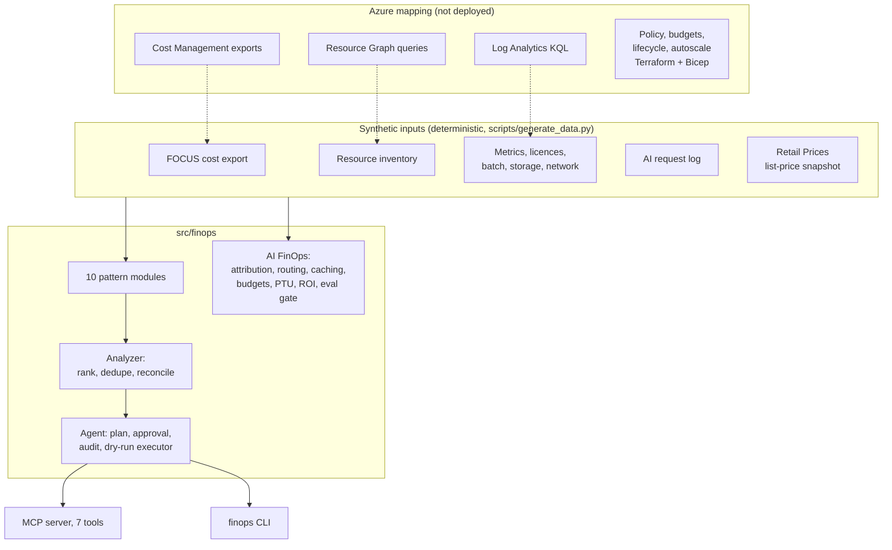

# Azure FinOps: 10 cost patterns, AI FinOps and an approval-gated FinOps agent

[](https://github.com/jagadishmazure-jpg/Jagadish-azure-finops/actions/workflows/ci.yml)
[](https://github.com/jagadishmazure-jpg/Jagadish-azure-finops/actions/workflows/infra.yml)

## At a glance (for recruiters)

- **Ten Azure cost optimization patterns as working code:** rightsizing, autoscale, reservations
  and savings plans, Spot, storage tiering, Hybrid Benefit, serverless, idle cleanup, tagging and
  chargeback, cache and egress. Each one has detection logic, a decision rule, tests and a full
  write-up.
- **$6,159.31 a month (48.5%) of proposed savings** on a synthetic $12,696.61-a-month estate for a
  fictional company, priced from a checked-in Azure Retail Prices **list-price snapshot**. Estimates
  are labelled, and every claimed saving is reconciled to the FOCUS cost export (12 of 12 checks
  within 5%).
- **AI FinOps:** per-request token cost attribution that reconciles to the bill, model routing with
  a cheap classifier, prompt and semantic caching, budget guardrails per agent and tenant, PTU vs
  pay-as-you-go break-even, ROI per AI use case, and an **eval gate**: a cost cut only ships if
  quality holds (routing plus caching saves $200.75 a month at -0.45 points; "everything on the
  small model" is blocked at -10.78 points).
- **A FinOps agent over MCP that cannot change anything on its own:** it drafts plans; people
  approve them (bound to a SHA-256 digest, 72-hour expiry, two approvers for irreversible steps);
  execution is a dry run with a hash-chained audit log. There is no approve tool.
- **A real-world case study, anonymized:** an idle Logic Apps Standard WS1 plan at $0.2399 an hour
  ($175.16 a month) and a Container App kept warm with `minReplicas = 1`.
- **Terraform + Bicep guardrails:** Azure Policy (required tags, allowed VM sizes, deny untagged
  public IPs), a budget with an action group, a storage lifecycle policy and an autoscale example,
  on the smallest settings. GitHub Actions with OIDC (no secrets), dev to prod approval, and a
  Terraform or Bicep choice, switched off until a subscription is configured.
- **235 automated tests**, all offline, plus docs whose numbers and code excerpts are regenerated
  from the code and checked in CI.

**Skills demonstrated:** Azure FinOps, Cost Management and FOCUS exports, Azure Advisor, Azure
Policy, Azure Resource Graph and KQL, reservations and savings plans, Azure OpenAI cost and PTU
sizing, MCP, Terraform, Bicep, GitHub Actions (OIDC), Python.

*Honesty note: everything runs offline on synthetic data for a fictional company (Larkspur
Freight). Nothing is deployed to Azure, prices are list prices from a snapshot, and quality and
eviction numbers in the AI and Spot sections are simulated.*

**Contents:** [Why](#why-it-exists) · [Results](#results) · [Architecture](#architecture) · [Run](#run-it) ·
[Test](#test) · [Deploy](#deploy) · [Limits](#limits) · [Docs](#documentation)

## Why it exists

Cost optimization advice is easy to find and hard to trust. This repo turns each pattern into code
that shows its evidence, its decision rule, what it deliberately skipped, and the math behind every
dollar, so the advice can be checked, argued with and run again. It is built for the work of an
AI FinOps and ROI coach: knowing what the cloud and the models cost, who spent it, what to change,
and whether a cheaper option is still good enough.

## Results

Real output of `finops estate`:

<!-- output: estate -->
```text
== estate: Larkspur Freight (fictional), list-price snapshot
  billed (30-day FOCUS export, projected to 730 h): $12,696.61/mo
  p01-rightsize            save    $713.94/mo
  p02-autoscale            save    $811.80/mo
  p03-commitments          save    $348.79/mo
  p04-spot                 save    $301.06/mo
  p05-storage-tiering      save  $1,844.01/mo
  p06-hybrid-benefit       save    $493.48/mo
  p07-serverless           save    $318.09/mo
  p08-idle-cleanup         save    $397.76/mo
  p10-cache-egress         save    $930.38/mo
  TOTAL proposed savings $6,159.31/mo (48.5% of the bill), $73,911.72/yr
  findings: 29; conflicts resolved: 0; reconciliation checks: 12/12 within 5% of the bill
  top 10:
    p05-57493bab  stlkdatalake/raw-telemetry lifecycle 0d+:hot / 30d+:cool / 90d+:cold / 180d+:archive save $1,483.60/mo [medium]
    p10-72fd9262  nightly-lake-copy          incremental copy (12% changed) instead of full       save   $739.20/mo [low]
    p02-062bff75  aks-dispatch-prod          cluster autoscaler 6 fixed -> 2..8 (avg 3.26)        save   $384.61/mo [low]
    p05-90f3919e  stlkdatalake/shipment-docs lifecycle 0d+:hot / 30d+:cool / 90d+:cold / 180d+:cold save   $360.41/mo [low]
    p02-871c3129  asp-portal-prod            autoscale 6 fixed -> 2..10 (avg 2.88)                save   $352.92/mo [low]
    p03-3cd341af  D-series fleet (lk-prod)   buy reservation-1y for 13 x D2s_v5 units             save   $348.79/mo [low]
    p06-b0c06dc2  vm-dispatch-db-01          AHB SQL Server standard (4 cores)                    save   $292.00/mo [low]
    p04-5cc2a5d5  pool:route-optimizer       Spot nodes, checkpoint every 15 min (10x D8s_v5)     save   $233.64/mo [low]
    p01-b7c97d53  asp-partner-api            resize P2v3 -> P1v3                                  save   $226.30/mo [low]
    p07-300c5e49  la-invoice-intake          WS1 plan -> Logic Apps Consumption                   save   $172.16/mo [low]
```
<!-- /output -->

| # | Pattern | Headline result | Doc |
|---|---|---|---|
| 1 | Rightsize compute | $713.94/mo, 5 resources, one flagged medium risk for its peak | [01-rightsize](docs/patterns/01-rightsize.md) |
| 2 | Autoscale | $811.80/mo; 6 fixed web instances average 2.88 | [02-autoscale](docs/patterns/02-autoscale.md) |
| 3 | Reservations and savings plans | $348.79/mo, 13 x D2s_v5 1-year reservation, break-even 7.4 months | [03-commitments](docs/patterns/03-commitments.md) |
| 4 | Spot | $301.06/mo (estimate), deadlines met with checkpoints | [04-spot](docs/patterns/04-spot.md) |
| 5 | Storage tiering | $1,844.01/mo (estimate) and a generated lifecycle policy | [05-storage-tiering](docs/patterns/05-storage-tiering.md) |
| 6 | Hybrid Benefit | $493.48/mo within a 16-core Windows and 4-core SQL pool | [06-hybrid-benefit](docs/patterns/06-hybrid-benefit.md) |
| 7 | Serverless first | $318.09/mo; and one function that must stay on its plan ($3,282.30 on consumption) | [07-serverless](docs/patterns/07-serverless.md) |
| 8 | Idle cleanup | $397.76/mo, behind a two-person approval | [08-idle-cleanup](docs/patterns/08-idle-cleanup.md) |
| 9 | Tagging and chargeback | 98.8% of cost tagged, showback for 5 cost centers, one budget forecast at 104.2% | [09-tagging-chargeback](docs/patterns/09-tagging-chargeback.md) |
| 10 | Cache and egress | $930.38/mo (estimate), mostly incremental DR copies | [10-cache-egress](docs/patterns/10-cache-egress.md) |
| AI | AI FinOps | $571.02/mo attributed with a $0.00 gap; $200.75/mo shipped through the eval gate | [ai-finops](docs/ai-finops.md) |
| CS | Case study | $186.99/mo of idle integration and container cost | [case-study](docs/case-study.md) |

## Architecture



More in [docs/architecture.md](docs/architecture.md).

## Run it

```bash
git clone https://github.com/jagadishmazure-jpg/Jagadish-azure-finops.git
cd Jagadish-azure-finops
python -m venv .venv && . .venv/bin/activate
pip install -e ".[dev]"

finops scan              # all ten patterns and the estate total
finops pattern p07 --evidence
finops ai                # AI FinOps report
finops case-study
finops mcp-demo          # scripted MCP session: plan, refusal, two approvals, dry run
finops mcp               # run the agent as an MCP server (stdio)
```

Step by step, including connecting to a real subscription in read-only mode:
[docs/implementation-guide.md](docs/implementation-guide.md).

## Test

```bash
pytest -q                               # 235 tests, offline
ruff check . && ruff format --check .
python scripts/generate_data.py --check # synthetic data matches the generator
python scripts/render_docs.py --check   # doc outputs and code excerpts match the code
python scripts/refresh_prices.py --check # compare the snapshot with the live Retail Prices API (network)
```

## Deploy

The guardrail infrastructure (policy definitions and assignments, action group, budget, a storage
account with a lifecycle policy, an opt-in autoscale demo) deploys with either Terraform or Bicep
through [`.github/workflows/deploy.yml`](.github/workflows/deploy.yml): OIDC login, dev first, then
prod after a reviewer approves. It is **gated off** until the repository variable `DEPLOY_ENABLED`
is `true`. Setup: [docs/deployment.md](docs/deployment.md).

## Limits

- Synthetic data for a fictional company; patterns are shaped like real estates but no real
  customer data is used.
- List prices only, from one snapshot and one region (East US 2); negotiated discounts, credits and
  most free grants are not modeled.
- Spot evictions, AI answer quality, cache hit ratios and changed fractions are assumptions or
  simulations, and labelled as such.
- AKS uptime SLA, SQL Database, networking appliances and support plans are not modeled.
- Nothing is deployed; the agent's executor is dry-run only by design.

## Documentation

| Doc | What it covers |
|---|---|
| [docs/patterns/](docs/patterns/README.md) | The ten pattern write-ups (13 sections each) |
| [docs/ai-finops.md](docs/ai-finops.md) | Token attribution, routing, caching, budgets, PTU, ROI, eval gate |
| [docs/finops-agent.md](docs/finops-agent.md) | The agent, its MCP tools and the approval model |
| [docs/case-study.md](docs/case-study.md) | The idle WS1 plan and warm Container App |
| [docs/implementation-guide.md](docs/implementation-guide.md) | Clean clone to demo, then a real subscription read-only |
| [docs/finops-maturity.md](docs/finops-maturity.md) | Crawl, walk, run, applied to these patterns |
| [docs/best-practices.md](docs/best-practices.md) | The rules this repo follows |
| [docs/architecture.md](docs/architecture.md) | Components, data flow, Azure mapping |
| [docs/deployment.md](docs/deployment.md) | One-time setup and the gated workflows |
| [docs/interview-guide.md](docs/interview-guide.md) | How to walk through it in an interview |
| [docs/adr/](docs/adr/README.md) | Six architecture decision records |
| [SECURITY.md](SECURITY.md) · [CONTRIBUTING.md](CONTRIBUTING.md) · [CHANGELOG.md](CHANGELOG.md) | Project policies |

## License

MIT, see [LICENSE](LICENSE).
