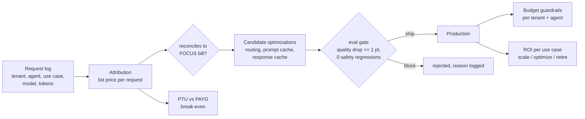

# AI FinOps: cost, routing, caching, budgets, PTU and ROI

**Modules:** [`src/finops/ai/`](../src/finops/ai/) · **Tests:** [`tests/test_ai_finops.py`](../tests/test_ai_finops.py) ·
**Run:** `finops ai`

Generative AI breaks the usual FinOps model in three ways. The bill has one line per model meter,
so it cannot say which tenant, agent or use case spent the money. Cost depends on behaviour
(prompt length, retries, model choice), not on provisioned capacity. And every cost cut can
quietly lower answer quality. This section answers all three with code: attribute every request,
cut cost only through an eval gate, and judge each use case on ROI, not on spend.



The data is a synthetic request log of 6,000 sampled requests, each weighted 10 to represent
60,000 requests a month across three agents and four tenants (`data/ai/requests.jsonl`). Prices are
the gpt-4o and gpt-4o-mini meters in the list-price snapshot. Quality is **simulated** (a fixed pass
rate per model and difficulty, sampled per request id) to show how the gate works; real pass rates
come from your own eval set.

## The full report

<!-- output: ai -->
```text
== ai-finops: token cost attribution, routing, caching, budgets, PTU, ROI
  requests/month 60,000  cost $571.02  per request p50 $0.0056 p95 $0.0188
  reconcile to FOCUS bill: attributed $571.02 vs billed $571.02 gap $0.00 -> OK
  by_tenant: internal $80.83, tenant-acme-retail $232.93, tenant-bluebird-pharma $143.39, tenant-cobalt-auto $113.88
  by_agent: dispatch-summarizer $138.88, eta-assistant $223.05, invoice-triage $209.10
  by_use_case: customer-eta-chat $223.05, dispatch-shift-summary $138.88, invoice-exception-triage $209.10
  router confusion (label->route): {'simple->small': 2913, 'simple->large': 612, 'complex->small': 75, 'complex->large': 2400}
  response cache: 164 exact + 182 semantic hits of 6000 requests (5.77%); loose threshold serves 196 wrong answers
  eval gate (max quality drop 1.0 pt) vs baseline $571.02 @ 96.73%:
    SHIP  route simple -> gpt-4o-mini                        $420.51  quality  96.18% (-0.55)  save   $150.51  quality within budget
    SHIP  provider prompt caching                            $475.02  quality  96.73% (+0.00)  save    $96.00  quality within budget
    SHIP  response cache (exact + semantic 0.85)             $553.27  quality  96.83% (+0.10)  save    $17.75  quality within budget
    BLOCK semantic cache, loose threshold 0.45               $544.39  quality  93.65% (-3.08)  save    $26.64  quality -3.08 pts exceeds the -1.0 pt budget
    BLOCK everything on gpt-4o-mini                           $34.26  quality  85.95% (-10.78)  save   $536.76  quality -10.78 pts exceeds the -1.0 pt budget
    SHIP  combined: route + prompt cache + response cache    $370.27  quality  96.28% (-0.45)  save   $200.75  quality within budget
  PTU: peak 15,644 TPM -> 15 PTU = $10,950.00/mo vs PAYG $571.02/mo; utilization 13.91%; break-even at 19.2x today's volume (266.7% utilization) -> stay pay-as-you-go (hourly PTU cannot break even even at 100% utilization; use PTU only for latency guarantees or with a PTU reservation)
  budget guardrails: {'normal': 4300, 'degraded': 1485, 'blocked': 0, 'critical_over_budget': 215} -> spend $465.89 (from $571.02)
    day 17: agent:eta-assistant reached 80% of $150
    day 17: tenant:tenant-cobalt-auto reached 80% of $80
    day 18: tenant:tenant-acme-retail reached 80% of $170
    day 18: agent:dispatch-summarizer reached 80% of $100
    day 20: agent:eta-assistant reached 100% of $150
    day 22: agent:dispatch-summarizer reached 100% of $100
    day 22: tenant:tenant-cobalt-auto reached 100% of $80
    day 24: tenant:tenant-acme-retail reached 100% of $170
    day 24: agent:invoice-triage reached 80% of $200
    day 25: tenant:tenant-bluebird-pharma reached 80% of $130
    day 28: tenant:internal reached 80% of $75
    day 29: agent:invoice-triage reached 100% of $200
  ROI per use case (before -> after the shipped optimizations):
    customer-eta-chat          tasks 38,010  value $21,665.70  cost $2,153.05 -> $1,987.48  ROI  906.3% ->  990.1%  payback 2.0 -> 2.0 mo  [scale]
    invoice-exception-triage   tasks 13,180  value $34,268.00  cost $3,137.43 -> $3,116.35  ROI  992.2% ->  999.6%  payback 1.9 -> 1.9 mo  [scale]
    dispatch-shift-summary     tasks  8,810  value    $991.12  cost $1,548.88 -> $1,534.78  ROI  -36.0% ->  -35.4%  payback 43.3 -> 42.5 mo  [rework or retire]
```
<!-- /output -->

## 1. Per-request token cost attribution

Every model call logs tenant, agent, use case, model and token counts (OpenTelemetry `gen_ai.*`
attributes in Application Insights). Cost is computed per request from the price list:

<!-- code: src/finops/ai/token_cost.py::request_cost -->
```python
def request_cost(req: dict[str, Any], model: str | None = None, prompt_cache: bool = False, book: PriceBook | None = None) -> float:
    """List cost of one call (unweighted). ``prompt_cache`` bills the shared prefix at the cached
    input rate where the snapshot has one (gpt-4o); other models fall back to the input rate."""
    book = book or default_book()
    model = model or req["model"]
    pin = book.price(f"aoai.{model}.input_1k")
    pcached = book.price(f"aoai.{model}.cached_input_1k") if f"aoai.{model}.cached_input_1k" in book else pin
    pout = book.price(f"aoai.{model}.output_1k")
    cached = cached_prefix_tokens(req["system_prefix_tokens"]) if prompt_cache else 0
    return ((req["prompt_tokens"] - cached) * pin + cached * pcached + req["completion_tokens"] * pout) / 1000
```
<!-- /code -->

The attributed total is then **reconciled** to the Azure OpenAI lines of the FOCUS export. Here
the gap is $0.00 on $571.02, so the split by tenant can be used for chargeback. If the gap grows,
something is calling the model without logging (a batch job, a retry loop, a forgotten test).

<!-- code: queries/kql/ai-token-cost.kql -->
```kusto
// AI FinOps: per-request token attribution. Each model call logs tenant, agent, use case, model and
// token counts as custom dimensions (OpenTelemetry gen_ai.* attributes). Prices come from the
// list-price snapshot loaded as a datatable or external table.
let prices = datatable(model:string, input_1k:real, cached_1k:real, output_1k:real) [
    'gpt-4o', 0.0025, 0.00125, 0.01,
    'gpt-4o-mini', 0.00015, 0.00015, 0.0006
];
AppDependencies
| where TimeGenerated > ago(30d)
| where Type == 'GenAI' or isnotempty(customDimensions['gen_ai.request.model'])
| extend model = tostring(customDimensions['gen_ai.request.model']),
         tenant = tostring(customDimensions['tenant']), agent = tostring(customDimensions['agent']),
         use_case = tostring(customDimensions['use_case']),
         input_tokens = toint(customDimensions['gen_ai.usage.input_tokens']),
         cached_tokens = toint(customDimensions['gen_ai.usage.cached_tokens']),
         output_tokens = toint(customDimensions['gen_ai.usage.output_tokens'])
| lookup prices on model
| extend cost = ((input_tokens - cached_tokens) * input_1k + cached_tokens * cached_1k + output_tokens * output_1k) / 1000
| summarize requests = count(), cost = sum(cost), p95_cost = percentile(cost, 95) by tenant, agent, use_case, model
| order by cost desc
```
<!-- /code -->

Per request, the median call costs $0.0056 and the 95th percentile $0.0188: long summaries, not
chat turns, drive the tail.

## 2. Model routing with a System-1 classifier

A cheap, deterministic classifier runs before any model call. It sends obviously simple requests
(short status and ETA questions) to gpt-4o-mini and everything else, including anything it is
unsure about, to gpt-4o. Mistakes cost money, not quality:

<!-- code: src/finops/ai/routing.py::classify -->
```python
def classify(prompt: str) -> tuple[str, float]:
    """Return (route, confidence). Unsure -> large model."""
    words = re.findall(r"[a-z]+", prompt.lower())
    ws = set(words)
    if ws & COMPLEX_CUES:
        return LARGE, 0.95
    if ws & SIMPLE_CUES and len(words) <= MAX_SIMPLE_WORDS:
        return SMALL, 0.9
    return LARGE, 0.5  # fail safe
```
<!-- /code -->

The router's confusion matrix is in the report: 75 complex requests reach the small model, and
612 simple ones still go to the large model because the classifier was unsure. Routing alone
saves $150.51 a month for a 0.55-point quality drop.

## 3. Prompt and semantic caching

Two different caches:

- **Provider prompt caching.** Repeated system prefixes of 1,024 tokens or more are billed at the
  cached input rate ($0.00125 instead of $0.0025 per 1K for gpt-4o). No quality impact: $96.00 a
  month saved, 0.00 points.
- **Response caching** (exact, then semantic). Keys include tenant and agent, entries expire, and
  a semantic hit must mention the same entity numbers, so "shipment 1001" never answers 1002.
  Only cacheable intents (status lookups) are cached:

<!-- code: src/finops/ai/caching.py::ResponseCache -->
```python
class ResponseCache:
    def __init__(self, ttl_days: int = 1, semantic: bool = True, threshold: float = THRESHOLD):
        self.ttl = ttl_days
        self.semantic = semantic
        self.threshold = threshold
        self.last_wrong = False
        self.exact: dict[tuple, int] = {}
        self.entries: dict[tuple, list[tuple[Counter, int]]] = {}

    def lookup(self, req: dict[str, Any]) -> str:
        """Return 'exact', 'semantic' or 'miss', and store the request on a miss. After a semantic
        hit, ``last_wrong`` says whether the cached answer was for a different intent."""
        self.last_wrong = False
        if req["agent"] not in CACHEABLE_AGENTS or req["label"] != "simple":
            return "miss"
        day = req["day"]
        key = (req["tenant"], req["agent"], normalize(req["prompt"]))
        if key in self.exact and day - self.exact[key] < self.ttl:
            return "exact"
        scope = (req["tenant"], req["agent"], numbers(req["prompt"]))
        vec = vector(req["prompt"])
        if self.semantic:
            for v, d in self.entries.get(scope, []):
                if day - d < self.ttl and cosine(vec, v) >= self.threshold:
                    self.last_wrong = set(v) != set(vec)
                    return "semantic"
        self.exact[key] = day
        self.entries.setdefault(scope, []).append((vec, day))
        return "miss"
```
<!-- /code -->

At a 0.85 similarity threshold it serves 164 exact and 182 semantic hits (5.77%), saving $17.75 a
month, and quality goes up slightly. At a loose 0.45 threshold it serves 196 wrong answers and the
gate blocks it. The similarity here is a deterministic bag-of-words stand-in; in Azure the same
logic runs on embeddings in Azure Managed Redis or AI Search.

## 4. Budget guardrails per agent and tenant

Spend is tracked as requests arrive, against both the tenant's and the agent's monthly budget,
whichever is further over:

| Level | At | Effect |
|---|---|---|
| Soft alert | 80% | notify owner once |
| Degrade | 100% | non-critical agents routed to the small model |
| Block | 120% | non-critical agents return a "budget reached" fallback |
| Critical agent | any | never blocked or degraded; owner is paged |

<!-- code: src/finops/ai/budgets.py::enforce -->
```python
def enforce(requests: list[dict[str, Any]], cfg: dict[str, Any]) -> dict[str, Any]:
    spend_t: dict[str, float] = defaultdict(float)
    spend_a: dict[str, float] = defaultdict(float)
    alerts: list[str] = []
    alerted: set[str] = set()
    counts = {"normal": 0, "degraded": 0, "blocked": 0, "critical_over_budget": 0}
    total = 0.0
    for q in sorted(requests, key=lambda r: (r["day"], r["request_id"])):
        t, a = q["tenant"], q["agent"]
        ratio = max(spend_t[t] / cfg["tenant_monthly_usd"][t], spend_a[a] / cfg["agent_monthly_usd"][a])
        critical = a in cfg["critical_agents"]
        for who, spent, budget in ((f"tenant:{t}", spend_t[t], cfg["tenant_monthly_usd"][t]), (f"agent:{a}", spend_a[a], cfg["agent_monthly_usd"][a])):
            for level, name in ((cfg["soft_alert"], "80%"), (cfg["degrade_at"], "100%"), (cfg["block_at"], "120%")):
                if spent >= budget * level and (who, name) not in alerted:
                    alerted.add((who, name))
                    alerts.append(f"day {q['day']:>2}: {who} reached {name} of ${budget:,.0f}")
        if ratio >= cfg["block_at"] and not critical:
            counts["blocked"] += 1
            continue
        model = q["model"]
        if ratio >= cfg["degrade_at"]:
            if critical:
                counts["critical_over_budget"] += 1
            else:
                model = SMALL
                counts["degraded"] += 1
        else:
            counts["normal"] += 1
        c = request_cost(q, model) * q["weight"]
        spend_t[t] += c
        spend_a[a] += c
        total += c
    return {"total": total, "counts": counts, "alerts": alerts, "spend_tenant": dict(spend_t), "spend_agent": dict(spend_a)}
```
<!-- /code -->

In the replayed month, 1,485 requests are degraded, none are blocked, and the critical
`invoice-triage` agent goes over budget on 215 requests without being cut off. Spend falls from
$571.02 to $465.89. The alert timeline shows `eta-assistant` hitting 80% on day 17: in a real
deployment that is the moment to look, not day 30.

<!-- code: queries/kql/ai-budget-burn.kql -->
```kusto
// AI FinOps: month-to-date burn per tenant against its budget; feeds the 80 / 100 / 120 % guardrail alerts.
let budgets = datatable(tenant:string, budget:real) ['tenant-acme-retail', 170.0, 'tenant-bluebird-pharma', 130.0, 'tenant-cobalt-auto', 80.0, 'internal', 75.0];
AppDependencies
| where TimeGenerated > startofmonth(now())
| extend tenant = tostring(customDimensions['tenant']), cost = todouble(customDimensions['finops.cost_usd'])
| summarize mtd = sum(cost) by tenant
| lookup budgets on tenant
| extend pct = round(100 * mtd / budget, 1)
| extend level = case(pct >= 120, 'block', pct >= 100, 'degrade', pct >= 80, 'alert', 'ok')
```
<!-- /code -->

## 5. PTU vs pay-as-you-go break-even

Provisioned throughput units buy reserved capacity by the hour.

<!-- code: src/finops/ai/ptu.py::analyze -->
```python
def analyze(input_tokens: float, output_tokens: float, payg_monthly: float) -> dict[str, Any]:
    book = default_book()
    equiv = input_tokens + OUTPUT_WEIGHT * output_tokens
    avg_tpm = equiv / MINUTES_PER_MONTH
    peak_tpm = avg_tpm * PEAK_FACTOR
    n = ptus_for(peak_tpm)
    ptu_monthly = n * book.price("aoai.ptu.global_hour") * HOURS_PER_MONTH
    capacity = n * TPM_PER_PTU * MINUTES_PER_MONTH
    utilization = equiv / capacity
    # PAYG cost per input-equivalent token at today's mix, and the volume where PTU breaks even
    payg_per_equiv = payg_monthly / equiv
    breakeven_equiv = ptu_monthly / payg_per_equiv
    return {
        "monthly_input_tokens": round(input_tokens), "monthly_output_tokens": round(output_tokens),
        "avg_tpm": round(avg_tpm), "peak_tpm": round(peak_tpm), "ptus": n,
        "ptu_monthly": round(ptu_monthly, 2), "payg_monthly": round(payg_monthly, 2),
        "utilization_pct": round(100 * utilization, 2),
        "breakeven_volume_multiple": round(breakeven_equiv / equiv, 1),
        "breakeven_utilization_pct": round(100 * breakeven_equiv / capacity, 1),
        "decision": decision(payg_monthly, ptu_monthly, breakeven_equiv / capacity),
    }
```
<!-- /code -->

At today's volume the peak minute needs 15,644 tokens per minute, so the minimum 15 PTUs, which
cost $10,950.00 a month at the hourly list price against $571.02 on pay-as-you-go. Utilization
would be 13.91%. Break-even needs 19.2 times today's volume, which is 266.7% of the capacity, so
hourly PTU can never break even for this workload: **stay pay-as-you-go**. PTU is for latency
guarantees, or for much larger steady load with a PTU reservation (not in the snapshot).
Throughput per PTU and the peak factor are **assumptions**; check the capacity calculator.

## 6. ROI per AI use case

<!-- code: src/finops/ai/roi.py::roi -->
```python
def roi(uc: dict[str, Any], tasks: float, token_monthly: float) -> dict[str, Any]:
    value = tasks * uc["adoption"] * uc["minutes_saved_per_task"] / 60 * uc["loaded_rate_per_hour"]
    run = token_monthly + uc["platform_monthly"]
    amort = uc["build_cost"] / uc["amortize_months"]
    cost = run + amort
    margin = value - run
    r = (value - cost) / cost
    verdict = "scale" if r >= 1 else ("keep and optimize" if r >= 0 else "rework or retire")
    return {
        "use_case": uc["use_case"], "tasks": round(tasks), "value": round(value, 2), "token_cost": round(token_monthly, 2),
        "platform": uc["platform_monthly"], "amortized_build": round(amort, 2), "total_cost": round(cost, 2),
        "roi_pct": round(100 * r, 1), "payback_months": round(uc["build_cost"] / margin, 1) if margin > 0 else None,
        "cost_per_task": round(cost / tasks, 4) if tasks else None, "verdict": verdict,
    }
```
<!-- /code -->

| Use case | Value / month | Cost / month (after) | ROI | Verdict |
|---|---|---|---|---|
| customer-eta-chat | $21,665.70 | $1,987.48 | 990.1% | scale |
| invoice-exception-triage | $34,268.00 | $3,116.35 | 999.6% | scale |
| dispatch-shift-summary | $991.12 | $1,534.78 | -35.4% | rework or retire |

Token cost is a small share of total cost for all three; platform and amortized build cost
dominate. So `dispatch-shift-summary` cannot be fixed by cheaper tokens: the optimizations moved
it only from -36.0% to -35.4%. The question for the business owner is adoption and minutes saved,
which are the **assumptions** a coach should challenge first.

## 7. Eval-gated optimization

<!-- code: src/finops/ai/eval_gate.py::gate -->
```python
def gate(baseline: Candidate, cand: Candidate, max_quality_drop_pts: float = 1.0) -> Decision:
    delta = round(cand.quality_pct - baseline.quality_pct, 2)
    savings = round(baseline.monthly_cost - cand.monthly_cost, 2)
    if cand.safety_regressions:
        return Decision(cand.name, False, savings, delta, f"{cand.safety_regressions} safety regression(s)")
    if delta < -max_quality_drop_pts:
        return Decision(cand.name, False, savings, delta, f"quality {delta:+.2f} pts exceeds the -{max_quality_drop_pts} pt budget")
    if savings <= 0:
        return Decision(cand.name, False, savings, delta, "no saving")
    return Decision(cand.name, True, savings, delta, "quality within budget")
```
<!-- /code -->

The combined change (routing, prompt cache and response cache) ships: $200.75 a month saved for a
0.45-point drop. Two candidates are blocked even though they save more: everything on gpt-4o-mini
would save $536.76 but drops quality by 10.78 points, and the loose semantic cache drops it by 3.08.

## Risks and guardrails

| Risk | Guardrail |
|---|---|
| Unattributed spend | Reconciliation to the bill on every run |
| Cheaper model, worse answers | Eval gate with a quality budget and safety regressions as a hard stop |
| Cache leaks across tenants | Tenant and agent in every cache key |
| Stale cached answers | TTL, entity-number match, cacheable intents only |
| Runaway agent spend | Per-agent and per-tenant budgets that degrade, then block, non-critical agents |
| Over-buying PTU | Break-even utilization reported; hourly PTU refused when it cannot break even |

## Limitations

- Quality is simulated; plug in a real golden set and judge before trusting any SHIP.
- Only two models and one region are priced.
- Embeddings, AI Search and agent platform costs appear only as the ROI "platform" figure.

## Interview talking points

- "The bill tells you what the model cost. Attribution tells you who spent it, and it has to
  reconcile to the bill to be trusted. Here the gap is zero."
- "No cost cut ships without an eval. All-mini would save 94% and lose 10.78 points, so it is
  blocked. Routing plus caching saves $200.75 and loses 0.45."
- "Budgets degrade before they block, and never cut off a critical agent."
- "ROI, not spend, decides what to scale. One use case is negative ROI, and cheaper tokens will not
  save it."
