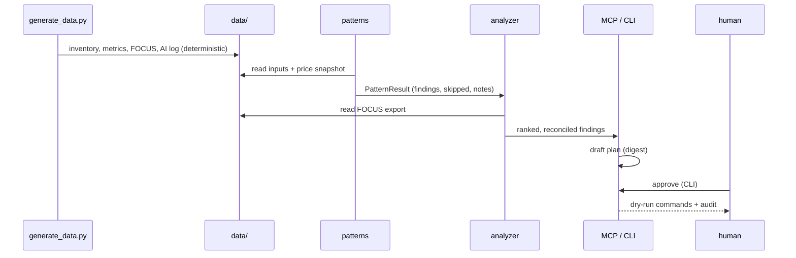

# Architecture

## Components

| Component | Path | Responsibility |
|---|---|---|
| Price book | `src/finops/pricing.py` | Loads the list-price snapshot; hourly, monthly, tiered, reservation and savings plan prices |
| Synthetic estate | `src/finops/synth.py`, `scripts/generate_data.py` | Deterministic inventory, metrics, FOCUS export, AI request log |
| Costing | `src/finops/costing.py` | Monthly cost of any inventory item from the price book |
| FOCUS | `src/finops/focus.py` | FOCUS 1.0 subset writer and reader |
| Patterns | `src/finops/patterns/p01..p10` | Detection, decision rule, findings with evidence |
| AI FinOps | `src/finops/ai/` | Attribution, routing, caching, budgets, PTU, ROI, eval gate |
| Analyzer | `src/finops/agent/analyzer.py` | Rank, dedupe, reconcile to the bill |
| Plans and approvals | `src/finops/agent/plan.py`, `approval.py` | Digest-bound plans, approval rules, audit log, dry-run executor |
| MCP server | `src/finops/agent/mcp_server.py` | Seven tools, no approve tool |
| CLI | `src/finops/cli.py` | `scan`, `estate`, `pattern`, `ai`, `agent`, `case-study`, `approve`, `mcp`, `mcp-demo` |
| Queries | `queries/arg`, `queries/kql` | Resource Graph and Log Analytics versions of each signal |
| IaC | `infra/terraform`, `infra/bicep`, `infra/policies` | Guardrails: policy, budget, alerts, lifecycle, autoscale |

## Data flow



## A finding

Every pattern returns `Finding` objects with the same shape, which is what lets one analyzer and
one agent handle ten different patterns:

<!-- code: src/finops/patterns/base.py::Finding -->
```python
@dataclass
class Finding:
    pattern: str
    resource_id: str
    resource_name: str
    action: str
    current_monthly: float
    proposed_monthly: float
    confidence: str = "high"  # high | medium | low
    risk: str = "low"  # low | medium | high
    change: dict[str, Any] = field(default_factory=dict)  # machine-readable proposed change
    evidence: dict[str, Any] = field(default_factory=dict)
    reversible: bool = True
    estimate: bool = False  # True when the saving rests on an assumption, not only list prices

    @property
    def savings_monthly(self) -> float:
        return round(self.current_monthly - self.proposed_monthly, 2)

    @property
    def id(self) -> str:
        raw = f"{self.pattern}|{self.resource_id}|{self.action}"
        return f"{self.pattern.split('-')[0]}-{hashlib.sha256(raw.encode()).hexdigest()[:8]}"

    def to_dict(self) -> dict[str, Any]:
        d = asdict(self)
        d["id"] = self.id
        d["savings_monthly"] = self.savings_monthly
        d["current_monthly"] = round(self.current_monthly, 2)
        d["proposed_monthly"] = round(self.proposed_monthly, 2)
        return d
```
<!-- /code -->

## Mapping to Azure

| Here | In Azure |
|---|---|
| `data/focus/cost-export.csv` | Cost Management scheduled FOCUS export |
| `data/inventory/resources.json` | Resource Graph (`queries/arg`) |
| `data/metrics/*.json` | Azure Monitor metrics, VM Insights, Container Insights (`queries/kql`) |
| `data/pricing/retail-prices-snapshot.json` | Retail Prices API or the negotiated price sheet |
| `data/ai/requests.jsonl` | Application Insights traces with `gen_ai.*` attributes |
| `infra/policies/*.json` | Azure Policy definitions |
| Plans and approvals | Change tickets, GitHub environment reviews, Azure Automation with approval |

## What runs where

Everything in this repo runs locally or in GitHub Actions. The only Azure resources defined are
the guardrails in `infra/`, and they are deployed only by the gated workflow.
