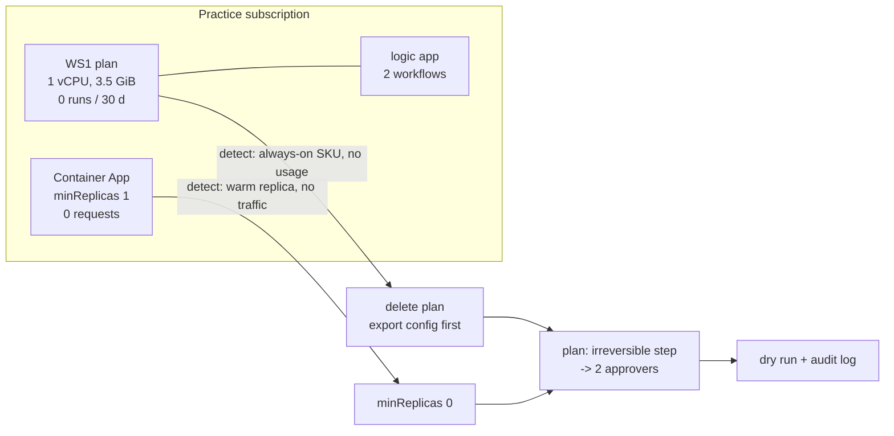

# Case study: the idle integration plan and the warm container

**Module:** [`src/finops/casestudy.py`](../src/finops/casestudy.py) · **Data:** [`data/case-study/inventory.json`](../data/case-study/inventory.json) ·
**Run:** `finops case-study`

This reproduces, anonymized, a pattern found in a real cost review of a practice subscription.
The resource names, subscription and numbers below are **synthetic**; only the shape of the
problem is real. No subscription IDs or account details are included.

## What was found

Two resources looked harmless in the portal and billed around the clock:

1. A **Logic Apps Standard WS1** plan hosting one logic app with two workflows and **zero runs**
   in 30 days. A WS plan is dedicated compute: it bills per vCPU and GiB hour whether workflows
   run or not.
2. A **Container App** with `minReplicas = 1` and **zero requests**. One replica is kept warm, so
   it bills the idle rate every second of the month.



## The numbers

<!-- output: case-study -->
```text
== case study: idle Logic Apps Standard WS1 plan + Container App held warm (anonymized, synthetic data)
  WS1 = 1 vCPU x $0.192/h + 3.5 GiB x $0.0137/h = $0.2399/h -> x 730 h = $175.16/mo
  Container App idle replica (0.5 vCPU, 1 GiB) = $0.0000045/s x 2,628,000 s = $11.83/mo
  finding case-55825717: asp-practice-ws1: delete idle WS1 plan (0 workflow runs in 30 d (last run 47 d ago)): $175.16 -> $0.00
  finding case-b4d51adc: ca-practice-agent: minReplicas 1 -> 0 (zero requests in 30 d): $11.83 -> $0.00
  total: save $186.99/mo, $2,243.88/yr
  plan plan-aa3a947fb5: 2 step(s), irreversible=True, needs 2 approvers
  execute without approval -> refused: needs 2 distinct approver(s), has 0
  [DRY-RUN] az appservice plan delete -g rg-practice-integration -n asp-practice-ws1 --yes  # delete or move any (idle) apps on the plan first
  [DRY-RUN] az containerapp update -g rg-practice-agent -n ca-practice-agent --min-replicas 0
  audit chain: 4 entries, verified=True
  lesson: idle cost hides in 'always-on' SKUs; detect by usage (runs, requests), not by resource count
```
<!-- /output -->

- WS1: 1 vCPU x $0.192/h + 3.5 GiB x $0.0137/h = **$0.2399 an hour**, x 730 h = **$175.16 a month**.
- Idle replica: 0.5 vCPU and 1 GiB at the idle rates = $0.0000045 a second, x 2,628,000 seconds =
  **$11.83 a month** (the monthly free grant ignored).
- Together **$186.99 a month, $2,243.88 a year**, for nothing.

## How it was detected

The same `detect()` function as pattern 8 runs over the case-study inventory. The signals are
usage, not configuration: workflow runs from `LogicAppWorkflowRuntime`
([`logic-apps-standard-runs.kql`](../queries/kql/logic-apps-standard-runs.kql)) and requests from
Container Apps metrics ([`container-apps-requests.kql`](../queries/kql/container-apps-requests.kql)).
Resource Graph alone would have shown a healthy plan with one app on it.

## What the agent did, and did not do

- It drafted one plan with two steps and marked it **irreversible** (deleting the plan), so it
  needs **two** distinct approvers.
- Asked to execute without approval, it **refused**.
- After two approvals it printed the commands as a **dry run**. Nothing was changed.
- The audit chain has 4 entries and verifies.

## Lessons

1. Idle cost hides in always-on SKUs (WS, EP, App Service plans, warm replicas). Count usage, not
   resources.
2. A budget alert on a small practice subscription is worth having: $187 a month of idle cost
   is easy to miss without one. This repo's IaC deploys a $10 budget with alerts at 50%, 80%, 100% and a 110%
   forecast.
3. For practice and dev, prefer consumption hosting (Logic Apps Consumption, `minReplicas = 0`)
   by default; see [pattern 7](patterns/07-serverless.md) and [pattern 2](patterns/02-autoscale.md).

## Interview talking point

"In a review I found an idle Logic Apps Standard plan at about $0.24 an hour, around $175 a
month, plus a container app holding one warm replica with no traffic. Neither shows up as
'expensive' in a resource list. I detect this class of waste by usage signals, and the fix goes
through the same approval gate as everything else."
