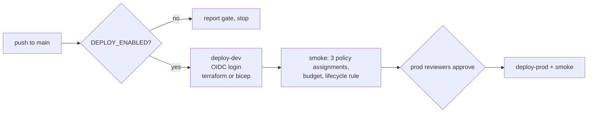

# Deployment

What deploys: the FinOps guardrails only. Three policy definitions (required tags, allowed VM
sizes, deny untagged public IPs) with assignments on the resource group, an action group, a
monthly budget with alerts, a Standard LRS storage account with last-access tracking and a
lifecycle policy, and an opt-in P0v3 plan with autoscale. Defaults are the smallest settings: a
$10 budget, Audit effect in dev, Deny in prod, autoscale demo off.

**It is switched off.** Every deploy job requires the repository variable `DEPLOY_ENABLED=true`.
Until then the workflow only reports the gate.

## Workflows

| Workflow | Trigger | What it does |
|---|---|---|
| `ci.yml` | push, PR | ruff, pytest, data and doc drift checks, `finops scan/ai/case-study`, `bicep build` with zero warnings, gitleaks over the full git history |
| `codeql.yml` | push, PR, weekly | CodeQL for the Python code and the workflow files; findings go to the Security tab |
| `infra.yml` | push, PR | terraform fmt, validate, test (mocked provider), tflint, checkov; plan only if OIDC variables exist |
| `deploy.yml` | push to main, manual | gate, then dev, then prod after reviewer approval; Terraform or Bicep |
| `teardown.yml` | manual | destroy one environment; type its name to confirm; prod needs approval |

## One-time setup

1. **App registration with a federated credential** for this repository, one subject per GitHub
   environment (`repo:<owner>/Jagadish-azure-finops:environment:dev` and `...:prod`). No client
   secret.
2. **Role assignments for that identity** on the subscription: Contributor plus Resource Policy
   Contributor (policy definitions are subscription scope). Remove them when you are done.
3. **GitHub environments** `dev` and `prod`; add required reviewers on `prod`.
4. **Repository variables:** `AZURE_CLIENT_ID`, `AZURE_TENANT_ID`, `AZURE_SUBSCRIPTION_ID`,
   `AZURE_LOCATION` (optional, default `eastus2`), `FINOPS_ALERT_EMAIL`, and for Terraform
   `TFSTATE_RESOURCE_GROUP`, `TFSTATE_STORAGE_ACCOUNT` (and optionally `TFSTATE_CONTAINER`).
5. **Terraform state storage** (Terraform only): a storage account with shared keys disabled and a
   `tfstate` container; the identity needs Storage Blob Data Contributor on it.
6. Set `DEPLOY_ENABLED=true`. Optionally `DEPLOY_TOOL=bicep`.

## Cost

With the defaults, the deployed resources are policy objects, an action group, a budget and an
empty storage account, which cost close to nothing at list price. The autoscale demo plan bills
while it exists, which is why it is off by default. Run `teardown.yml` when you are finished.

## Deploy script

[`.github/scripts/deploy.sh`](../.github/scripts/deploy.sh) holds the steps (`provision`, `smoke`,
`destroy`) so the workflow stays short and the same commands can run from a terminal after
`az login`.
