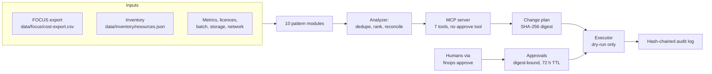

# The FinOps agent

**Modules:** [`src/finops/agent/`](../src/finops/agent/) · **Tests:** [`tests/test_agent.py`](../tests/test_agent.py),
[`tests/test_mcp_and_cli.py`](../tests/test_mcp_and_cli.py) · **Run:** `finops agent --top 5`,
`finops mcp-demo`, `finops mcp`

The agent reads a FOCUS cost export and a resource inventory, runs all ten patterns, ranks and
reconciles the findings, and drafts change plans. It **cannot change anything**. A plan only runs
after people approve that exact plan, and even then it runs as a dry run that prints the commands
change management would execute.



## What the analyzer does

1. Runs every pattern and collects findings.
2. **De-duplicates**: two findings that make the same kind of change to the same resource cannot
   both ship; the larger saving is kept and the conflict is recorded. (Patterns also hand
   resources to each other, for example p01 skips stopped VMs because p08 owns them.)
3. **Ranks** by monthly saving, then risk.
4. **Reconciles** each pattern's "current cost" against the FOCUS bill for the same resources
   (within 5%), so the agent cannot claim to save money that is not on the bill.

<!-- code: src/finops/agent/analyzer.py::reconcile -->
```python
def reconcile(findings: list[Finding], rows: list[CostRow]) -> list[dict[str, Any]]:
    """Check each finding's 'current' cost against what the bill shows for that resource."""
    billed = cost_by_resource(rows)
    out = []
    for f in findings:
        if f.resource_id not in billed or f.current_monthly == 0:
            continue
        # the bill can include extra meters (egress, storage); only compare like for like
        if f.pattern not in {"p01-rightsize", "p07-serverless", "p08-idle-cleanup"}:
            continue
        projected = billed[f.resource_id] * HOURS_PER_MONTH / OBSERVED_HOURS
        gap = (f.current_monthly - projected) / projected
        out.append(
            {
                "finding": f.id,
                "resource": f.resource_name,
                "model": round(f.current_monthly, 2),
                "bill": round(projected, 2),
                "gap_pct": round(100 * gap, 2),
                "ok": abs(gap) <= RECONCILE_TOLERANCE,
            }
        )
    return out
```
<!-- /code -->

<!-- output: agent --top 5 -->
```text
== estate: Larkspur Freight (fictional), list-price snapshot
  billed (30-day FOCUS export, projected to 730 h): $12,696.61/mo
  p01-rightsize            save    $713.94/mo
  p02-autoscale            save    $811.80/mo
  p03-commitments          save    $348.79/mo
  p04-spot                 save    $301.06/mo
  p05-storage-tiering      save  $1,844.01/mo
  p06-hybrid-benefit       save    $493.48/mo
  p07-serverless           save    $318.09/mo
  p08-idle-cleanup         save    $397.76/mo
  p10-cache-egress         save    $930.38/mo
  TOTAL proposed savings $6,159.31/mo (48.5% of the bill), $73,911.72/yr
  findings: 29; conflicts resolved: 0; reconciliation checks: 12/12 within 5% of the bill
  top 5:
    p05-57493bab  stlkdatalake/raw-telemetry lifecycle 0d+:hot / 30d+:cool / 90d+:cold / 180d+:archive save $1,483.60/mo [medium]
    p10-72fd9262  nightly-lake-copy          incremental copy (12% changed) instead of full       save   $739.20/mo [low]
    p02-062bff75  aks-dispatch-prod          cluster autoscaler 6 fixed -> 2..8 (avg 3.26)        save   $384.61/mo [low]
    p05-90f3919e  stlkdatalake/shipment-docs lifecycle 0d+:hot / 30d+:cool / 90d+:cold / 180d+:cold save   $360.41/mo [low]
    p02-871c3129  asp-portal-prod            autoscale 6 fixed -> 2..10 (avg 2.88)                save   $352.92/mo [low]
  plan plan-3bc1fb296c (digest 1151a64d424b...), 5 steps, status awaiting-approval:
    [DRY-RUN when approved] az storage account management-policy create --account-name stlkdatalake -g <rg> --policy @lifecycle-policy.json
    [DRY-RUN when approved] # change via infrastructure-as-code pull request: incremental copy (12% changed) instead of full
    [DRY-RUN when approved] az aks nodepool update -g rg-dispatch-prod --cluster-name aks-dispatch-prod -n nodepool1 --enable-cluster-autoscaler --min-count 2 --max-count 8
    [DRY-RUN when approved] az storage account management-policy create --account-name stlkdatalake -g <rg> --policy @lifecycle-policy.json
    [DRY-RUN when approved] az monitor autoscale create -g rg-portal-prod --resource asp-portal-prod --resource-type Microsoft.Web/serverfarms --min-count 2 --max-count 10 --count 2
```
<!-- /output -->

## Tools over MCP

| Tool | Hint | What it does |
|---|---|---|
| `estate_summary` | read-only | billed spend, savings by pattern, finding count |
| `list_findings` | read-only | ranked findings, filter by pattern and minimum saving |
| `explain_finding` | read-only | evidence, proposed change and the doc that explains the rule |
| `draft_change_plan` | read-only | builds a plan with commands and rollbacks; approves nothing |
| `plan_status` | read-only | approvals held vs required, and what is blocking |
| `execute_plan` | read-only, non-destructive | refuses without approvals; otherwise returns dry-run commands |
| `ai_cost_summary` | read-only | token cost by tenant and agent, and the gated AI optimizations |

There is deliberately **no approve tool**. Approval is a human act, done with the CLI
(`finops approve --plan ID --approver NAME --role ROLE`) or, in a real setup, a ticket or a GitHub
environment review.

## A full session

`finops mcp-demo` drives the server through an in-process MCP client, the same way an assistant
would:

<!-- output: mcp-demo -->
```text
tools: estate_summary (read-only), list_findings (read-only), explain_finding (read-only), draft_change_plan (read-only), plan_status (read-only), execute_plan (read-only), ai_cost_summary (read-only)
estate_summary -> billed $12,696.61/mo, savings $6,159.31/mo, 29 findings
list_findings(p08, >= $100) -> p08-caca8275 vm-poc-gpu-replacement $140.16, p08-21fab8f1 disk-migr-data-01 $122.88, p08-bdb84fca asp-poc-empty $113.15
explain_finding(p08-caca8275) -> evidence {"power_state": "stopped (not deallocated)"}, doc docs/patterns/08-idle-cleanup.md
draft_change_plan -> plan-807e909e91 digest d87946909f27..., $376.19/mo, irreversible=True, approvals_required=2
execute_plan (no approvals) -> refused: needs 2 distinct approver(s), has 0
human 1 approves (resource-owner) -> plan_status problems: ['needs 2 distinct approver(s), has 1']
human 2 approves (finops-approver) -> execute_plan dry_run=True:
  [DRY-RUN] az vm deallocate -g rg-sandbox-poc -n vm-poc-gpu-replacement
  [DRY-RUN] az snapshot create -g rg-sandbox-migration -n disk-migr-data-01-final --source disk-migr-data-01 && az disk delete -g rg-sandbox-migration -n disk-migr-data-01 --yes
  [DRY-RUN] az appservice plan delete -g rg-sandbox-poc -n asp-poc-empty --yes  # delete or move any (idle) apps on the plan first
audit log: 5 entries, chain verified=True
```
<!-- /output -->

## Approval rules

<!-- code: src/finops/agent/approval.py::check -->
```python
def check(plan: ChangePlan, approvals: list[Approval], now_hour: int) -> list[str]:
    """Return the list of problems (empty means the plan may be dry-run executed)."""
    problems = []
    valid = []
    for a in approvals:
        if a.plan_id != plan.plan_id or a.plan_digest != plan.digest:
            problems.append(f"approval by {a.approver} is for different plan content")
        elif now_hour - a.issued_at_hour > APPROVAL_TTL_HOURS:
            problems.append(f"approval by {a.approver} expired")
        else:
            valid.append(a)
    people = {a.approver for a in valid}
    if len(people) < required_approvals(plan):
        problems.append(f"needs {required_approvals(plan)} distinct approver(s), has {len(people)}")
    if any("purchase" in s.command for s in plan.steps) and not any(a.role == "finance" for a in valid):
        problems.append("commitment purchase needs a finance approver")
    return problems
```
<!-- /code -->

| Rule | Why |
|---|---|
| Approval is bound to the plan digest | An edited plan needs fresh approval |
| Requester cannot approve | No self-approval, human or agent |
| Roles: `finops-approver`, `resource-owner`, `finance` | Anyone else is refused |
| 1 approver if reversible, 2 distinct people if any step is irreversible | Deletes and purchases get four eyes |
| Commitment purchases need a `finance` approver | Money leaves the company for a year or more |
| Approvals expire after 72 hours | Estates change; stale approvals are dangerous |
| Live execution raises `NotImplementedError` | The repo can never change a real resource |

Every draft, approval, refusal and dry run is appended to a hash-chained audit log; editing any
entry breaks `verify()`.

## Running it as an MCP server

```bash
finops mcp                       # stdio transport
FINOPS_APPROVALS_DIR=/tmp/finops-approvals finops mcp
```

An MCP client config (for example in an IDE assistant):

```json
{
  "mcpServers": {
    "azure-finops": { "command": "finops", "args": ["mcp"] }
  }
}
```

Plans drafted over stdio are written to the approvals folder, so a person can approve them in
another terminal:

```bash
finops approve --plan plan-807e909e91 --approver owner@larkspur.example --role resource-owner
```

## Interview talking points

- "The agent proposes; people approve; the executor only prints. That separation is in the code,
  not in a prompt."
- "Approvals are bound to a hash of the plan, so nobody can approve one thing and run another."
- "Every claimed saving is reconciled to the FOCUS bill first: 12 of 12 checks within 5% here."
