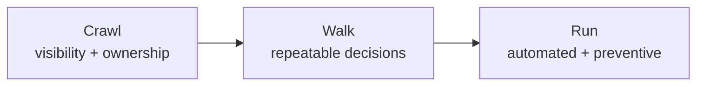

# FinOps maturity: crawl, walk, run

The FinOps Foundation describes maturity in three stages, crawl, walk and run, applied per
capability rather than to a whole company. A team can run on tagging and still crawl on
commitments. Below is how I use the model, in my own words, mapped to the patterns in this repo.

## The idea in one paragraph

**Crawl** means you can see the cost and someone owns it, even if the process is manual.
**Walk** means the process is repeatable: there are thresholds, owners act on findings, and the
numbers are trusted. **Run** means it is automated and built into how work gets done: guardrails
prevent waste before it exists, and decisions are made on unit economics, not totals. Moving
right costs effort, so the right stage for a capability is the one where the value justifies it.

## Per capability

| Capability | Crawl | Walk | Run | In this repo |
|---|---|---|---|---|
| Allocation (p09) | Tags exist on most resources; monthly cost report by subscription | Required tags enforced by policy; showback by cost center; owner map for the rest | Chargeback; unallocated cost near zero; tag compliance measured in dollars | require-tags policy, showback, 98.8% compliance |
| Budgets and anomalies | One budget per subscription | Budgets per cost center with forecast alerts | Anomaly alerts routed to owners; budgets in IaC | Terraform/Bicep budget, forecast alerts, `cost-anomaly.kql` |
| Rightsizing (p01) | Read Advisor once a quarter | p95 CPU + memory rule, monthly review | Continuous, with projected-peak checks and owner approvals | p01 rule with skip reasons |
| Elasticity (p02, p07) | Turn off dev at night by hand | Autoscale rules on the big tiers | Consumption or scale-to-zero by default; always-on needs a reason | p02 replay, p07 both-ways pricing |
| Commitments (p03) | Buy reservations from Advisor's suggestion | Size to the floor after optimization; track coverage and utilization | Portfolio of reservations and savings plans with a term policy and finance approval | p03 brute force + analytic check, term policy |
| Rate optimization (p06) | Know the licence pool exists | Apply Hybrid Benefit to obvious VMs | Central licence allocation by saving per core | p06 greedy allocation |
| Waste (p08) | Delete what someone notices | Scheduled queries, grace periods, owner sign-off | Approval-gated automation with audit; prevention by policy | p08 + agent plan, two approvers, deny-untagged-IP policy |
| Architecture (p04, p05, p10) | Case-by-case | Patterns documented with savings math | Cost is a design review input; lifecycle and caching by default | Spot simulation, lifecycle generator, cache math |
| AI cost | One line on the bill | Per-request attribution reconciled to the bill; budgets per tenant | Routing, caching and model choice behind an eval gate; ROI per use case decides funding | `src/finops/ai` |

## How I would sequence it for a new client

1. **Crawl, first month:** FOCUS export, tag compliance in dollars, budgets per cost center, the
   idle-resource queries. Quick wins (pattern 8) pay for the programme and build trust.
2. **Walk, next quarter:** rightsizing and autoscale with owners, Hybrid Benefit, storage lifecycle,
   then commitments sized on the optimized baseline.
3. **Run, ongoing:** policies in IaC, approval-gated automation, AI unit economics and ROI reviews.

## What "run" does not mean

It does not mean every capability fully automated. Deleting resources and buying commitments
should stay human decisions with good evidence. In this repo the most automated part is detection
and drafting; the decisions stay with people.
