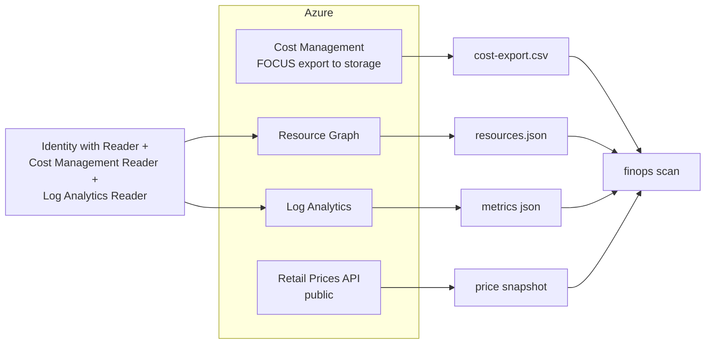

# Implementation guide

Two parts. Part A goes from a clean clone to the full demo, offline, in a few minutes. Part B
connects the same code to a real Azure subscription in **read-only** mode: exports, queries and
reports, with no write permissions anywhere.

## Part A: clean clone to demo

### 1. Prerequisites

| Tool | Version used here | Needed for |
|---|---|---|
| Python | 3.13 (3.11+ works) | everything |
| Terraform | 1.16 | optional, IaC checks |
| Bicep CLI | 0.47 | optional, IaC checks |

### 2. Install

```bash
git clone https://github.com/jagadishmazure-jpg/Jagadish-azure-finops.git
cd Jagadish-azure-finops
python -m venv .venv && . .venv/bin/activate
pip install -e ".[dev]"
```

### 3. Check the data and prices

The synthetic data is generated deterministically and checked in. Confirm your copy matches the
generator:

```bash
python scripts/generate_data.py --check
```

Prices come from `data/pricing/retail-prices-snapshot.json`, a **list-price snapshot** of the Azure
Retail Prices API for East US 2. To refresh it (needs network; the API is public and needs no
login): `python scripts/refresh_prices.py`. Re-run the tests and `python scripts/render_docs.py`
afterwards, because every number in the docs moves with the prices.

### 4. Run the patterns

```bash
finops scan                    # all ten patterns + estate total
finops pattern p03 --evidence  # one pattern, with evidence and the proposed change
finops estate --top 10
```

The estate summary you should see:

<!-- output: estate --top 3 -->
```text
== estate: Larkspur Freight (fictional), list-price snapshot
  billed (30-day FOCUS export, projected to 730 h): $12,696.61/mo
  p01-rightsize            save    $713.94/mo
  p02-autoscale            save    $811.80/mo
  p03-commitments          save    $348.79/mo
  p04-spot                 save    $301.06/mo
  p05-storage-tiering      save  $1,844.01/mo
  p06-hybrid-benefit       save    $493.48/mo
  p07-serverless           save    $318.09/mo
  p08-idle-cleanup         save    $397.76/mo
  p10-cache-egress         save    $930.38/mo
  TOTAL proposed savings $6,159.31/mo (48.5% of the bill), $73,911.72/yr
  findings: 29; conflicts resolved: 0; reconciliation checks: 12/12 within 5% of the bill
  top 3:
    p05-57493bab  stlkdatalake/raw-telemetry lifecycle 0d+:hot / 30d+:cool / 90d+:cold / 180d+:archive save $1,483.60/mo [medium]
    p10-72fd9262  nightly-lake-copy          incremental copy (12% changed) instead of full       save   $739.20/mo [low]
    p02-062bff75  aks-dispatch-prod          cluster autoscaler 6 fixed -> 2..8 (avg 3.26)        save   $384.61/mo [low]
```
<!-- /output -->

### 5. AI FinOps and the case study

```bash
finops ai
finops case-study
```

### 6. The agent

```bash
finops agent --top 5   # ranked findings and a dry-run plan
finops mcp-demo        # a scripted MCP session with refusal, approvals and a dry run
```

To use it from an MCP client, run `finops mcp` (stdio) and register it as
`{"command": "finops", "args": ["mcp"]}`. Plans drafted over MCP are saved to `approvals/` (or
`$FINOPS_APPROVALS_DIR`); approve them from another terminal:

```bash
finops approve --plan <plan_id> --approver you@example.com --role finops-approver
```

### 7. Tests and quality gates

```bash
pytest -q
ruff check . && ruff format --check .
python scripts/render_docs.py --check
python scripts/overlap_check.py <reference files>   # optional originality check
```

### 8. IaC checks (optional)

```bash
cd infra/terraform
terraform init -backend=false && terraform validate && terraform test
cd ../bicep && bicep build main.bicep --stdout > /dev/null
```

## Part B: connect to a real subscription, read-only

The goal is to feed real data into the same code without giving anything the right to change
your estate.



### 1. Identity and roles (read-only)

Use your own sign-in (`az login`) or a dedicated app registration with a federated credential. Grant
**only** these built-in roles, at the narrowest scope that covers what you want to review:

| Role | Scope | Why |
|---|---|---|
| Reader | subscription or management group | Resource Graph inventory |
| Cost Management Reader | subscription or billing scope | cost data and exports |
| Log Analytics Reader | the workspace(s) | metrics and usage queries |
| Storage Blob Data Reader | the export container | read the FOCUS files |

No Contributor, no Owner. The agent's executor is dry-run only, but read-only roles mean even a bug
cannot change anything.

### 2. Cost data: FOCUS export

In Cost Management, create a scheduled export of type **cost and usage details (FOCUS)** to a
storage container, daily, month to date. Download a file and place it at
`data/focus/cost-export.csv`. The loader (`finops.focus`) reads the FOCUS columns it needs
(`ResourceId`, `ResourceName`, `ServiceName`, `SkuId`, `EffectiveCost`, `ChargePeriodStart`,
`ConsumedQuantity`, `Tags`, and so on); extra columns are ignored.

### 3. Inventory: Resource Graph

The queries in [`queries/arg/`](../queries/arg/README.md) run as-is:

```bash
az graph query -q "$(cat queries/arg/unattached-disks.kql)" --first 1000 -o json
```

Map their output into the inventory shape in `data/inventory/resources.json` (`id`, `name`, `type`,
`sku`, `tags`, `properties`). The synthetic file shows exactly which properties each pattern reads.

### 4. Metrics and usage: Log Analytics

Run the queries in [`queries/kql/`](../queries/kql/README.md) against your workspace, for example:

```bash
az monitor log-analytics query -w <workspace-guid> --analytics-query "$(cat queries/kql/vm-utilization-p95.kql)"
```

VM memory needs VM Insights (Azure Monitor Agent); without it pattern 1 skips the VM rather than
guessing. Blob read traffic needs a `StorageBlobLogs` diagnostic setting.

### 5. Prices

`python scripts/refresh_prices.py` re-captures list prices. If you have negotiated prices, use the
price sheet from Cost Management instead and keep the snapshot format.

### 6. Run and review

```bash
finops scan > review.txt
finops agent --top 20
```

Treat the output as a review pack, not a to-do list: read the skip reasons, check the estimates'
assumptions, and take approved changes through your normal change process. The executor will not
run them for you.

### 7. Keep data out of git

Real exports and inventories contain subscription IDs and resource names. Keep them outside the
repo, or in a folder covered by `.gitignore`, and never commit them.
