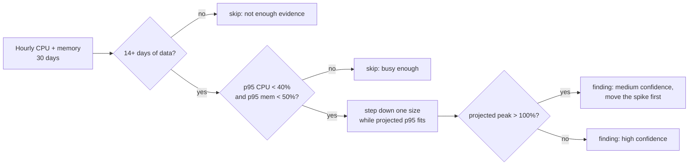
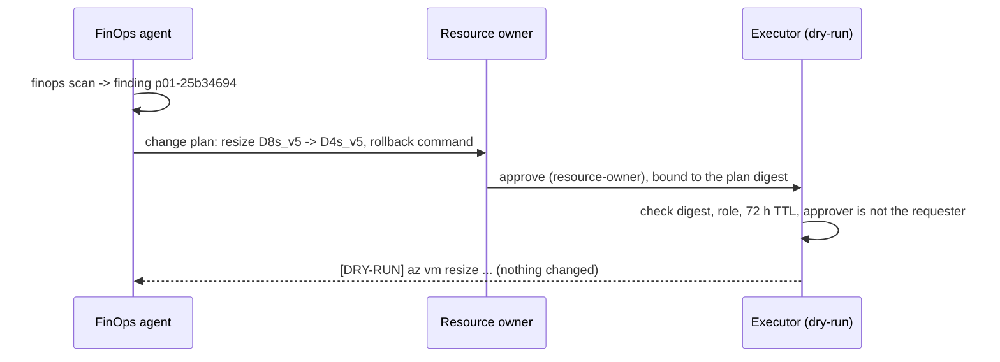

# Pattern 1: Rightsize compute to measured demand

**Module:** [`src/finops/patterns/p01_rightsize.py`](../../src/finops/patterns/p01_rightsize.py) ·
**Tests:** [`tests/test_p01_rightsize.py`](../../tests/test_p01_rightsize.py) ·
**Run:** `finops pattern p01 --evidence`

Most estates are sized for a launch-day guess, not for the load they actually see. This pattern
reads a month of hourly CPU and memory, steps each VM or App Service plan down its size family
while the projected load stays comfortable, and refuses to touch anything it cannot measure.



## 1. Problem

A VM bills for its size every hour it runs, whether the CPU sits at 9% or 90%. Oversized machines
are the most common line in an Advisor report, and they usually come from copying a production
size into every environment or from sizing for a peak that only happens once a week. The fix is
cheap and reversible (a resize is a reboot), but done carelessly it causes the outage that makes
teams stop trusting FinOps. The job here is to be right, not just aggressive.

## 2. Signals and data sources

| Signal | Where it comes from in Azure | Synthetic stand-in |
|---|---|---|
| Hourly CPU % (avg per hour) | Azure Monitor platform metric `Percentage CPU`, or `InsightsMetrics` from VM Insights | `data/metrics/utilization.json` |
| Hourly memory % | VM Insights (`Memory/AvailableMB` against total), App Service `MemoryPercentage` | same file |
| Size, OS, power state, plan instance count | Azure Resource Graph `resources` table | `data/inventory/resources.json` |
| Hourly price per size | Retail Prices API (list price) | `data/pricing/retail-prices-snapshot.json` |

Memory matters as much as CPU: a VM at 15% CPU and 80% memory is not oversized, and platform
metrics alone do not show memory. Without the agent, the pattern skips the machine instead of
guessing.

## 3. Detection logic

The thresholds live in one place, so a reviewer can argue with numbers instead of code:

<!-- code: src/finops/patterns/p01_rightsize.py::RULE -->
```python
RULE = {
    "min_hours": 14 * 24,
    "cpu_p95_max": 40.0,
    "mem_p95_max": 50.0,
    "target_cpu_p95": 65.0,
    "target_mem_p95": 75.0,
}
```
<!-- /code -->

The recommender walks down the size ladder, scaling the observed p95 by the capacity ratio
(half the vCPUs means twice the utilization for the same work):

<!-- code: src/finops/patterns/p01_rightsize.py::recommend -->
```python
def recommend(
    size: str, ladder: list[str], shapes: dict, cpu: list[float], mem: list[float]
) -> tuple[str, dict]:
    """Return (target size, evidence). Target == size means no change."""
    p95c, p95m, peak = percentile(cpu, 95), percentile(mem, 95), max(cpu)
    ev = {"cpu_p95": p95c, "mem_p95": p95m, "cpu_peak": peak, "hours": len(cpu)}
    if len(cpu) < RULE["min_hours"]:
        ev["reason"] = f"only {len(cpu)} h of metrics (< {RULE['min_hours']})"
        return size, ev
    if p95c >= RULE["cpu_p95_max"] or p95m >= RULE["mem_p95_max"]:
        ev["reason"] = f"p95 CPU {p95c}% / memory {p95m}% above the candidate thresholds"
        return size, ev
    target = size
    idx = ladder.index(size)
    while idx > 0:
        cand = ladder[idx - 1]
        rc = shapes[size][0] / shapes[cand][0]
        rm = shapes[size][1] / shapes[cand][1]
        if p95c * rc > RULE["target_cpu_p95"] or p95m * rm > RULE["target_mem_p95"]:
            break
        target, idx = cand, idx - 1
    if target == size:
        ev["reason"] = (
            "already the smallest size that keeps projected p95 within target"
            if idx
            else "smallest size in the family ladder"
        )
        return size, ev
    rc = shapes[size][0] / shapes[target][0]
    ev.update(
        projected_cpu_p95=round(p95c * rc, 1),
        projected_mem_p95=round(p95m * shapes[size][1] / shapes[target][1], 1),
        projected_cpu_peak=round(peak * rc, 1),
    )
    return target, ev
```
<!-- /code -->

Percentiles use the nearest-rank method, so the p95 is always a value that really happened:

<!-- code: src/finops/patterns/base.py::percentile -->
```python
def percentile(values: list[float], p: float) -> float:
    """Nearest-rank percentile (the method Azure Advisor-style rules usually describe)."""
    if not values:
        raise ValueError("no values")
    s = sorted(values)
    k = max(0, math.ceil(p / 100 * len(s)) - 1)
    return s[k]
```
<!-- /code -->

## 4. Decision rule

1. At least 14 days (336 hours) of hourly data, otherwise skip.
2. Candidate only if p95 CPU < 40% **and** p95 memory < 50%.
3. Step down one size at a time in the same family while projected p95 CPU stays at or below 65%
   and projected p95 memory at or below 75%.
4. If the projected **peak** goes above 100%, keep the finding but mark it medium confidence and
   medium risk, with a note to move or smooth the spike first.
5. Stopped, deallocated or empty resources are left to pattern 8; elastic plans with no metrics
   are left to pattern 2. One resource, one owner pattern.

## 5. Worked example

Real output of `finops pattern p01 --evidence` on the synthetic estate:

<!-- output: pattern p01 --evidence -->
```text
== p01-rightsize: Rightsize compute to measured demand
  asp-partner-api        resize P2v3 -> P1v3                                $452.60 ->    $226.30  save    $226.30/mo  [high/low]
  vm-dispatch-api-01     resize D8s_v5 -> D4s_v5                            $280.32 ->    $140.16  save    $140.16/mo  [high/low]
  vm-dispatch-api-02     resize D8s_v5 -> D4s_v5                            $280.32 ->    $140.16  save    $140.16/mo  [medium/medium]
  vm-dispatch-legacy-01  resize D4s_v5 -> D2s_v5                            $274.48 ->    $137.24  save    $137.24/mo  [high/low]
  vm-report-01           resize D4s_v5 -> D2s_v5                            $140.16 ->     $70.08  save     $70.08/mo  [high/low]
  skip vm-dispatch-db-01: p95 CPU 45.4% / memory 78.5% above the candidate thresholds
  skip asp-portal-prod: no utilization metrics (elastic plan; see autoscale p02)
  skip asp-tracking-prod: p95 CPU 51.0% / memory 51.2% above the candidate thresholds
  skip vm-etl-01: p95 CPU 45.3% / memory 78.7% above the candidate thresholds
  skip vm-build-01: p95 CPU 74.6% / memory 66.1% above the candidate thresholds
  skip vm-jump-01: p95 CPU 34.9% / memory 50.3% above the candidate thresholds
  skip asp-poc-empty: plan hosts 0 apps; handled by idle cleanup (p08)
  skip vm-poc-gpu-replacement: VM is stopped; handled by idle cleanup (p08)
  skip vm-poc-old-ui: VM is deallocated; handled by idle cleanup (p08)
  note: vm-dispatch-api-02: projected peak 157.4% > 100%; resize after moving the weekly spike or accept queuing
  TOTAL: 5 finding(s), $1,427.88 -> $713.94, save $713.94/mo (50.0%), $8,567.28/yr
  p01-b7c97d53 asp-partner-api
    evidence: {"cpu_p95": 20.6, "cpu_peak": 24.3, "hours": 720, "mem_p95": 32.4, "projected_cpu_p95": 41.2, "projected_cpu_peak": 48.6, "projected_mem_p95": 64.8}
    change:   {"from": "P2v3", "kind": "app-service-plan", "op": "resize", "to": "P1v3"}
  p01-25b34694 vm-dispatch-api-01
    evidence: {"cpu_p95": 19.8, "cpu_peak": 23.7, "hours": 720, "mem_p95": 32.4, "projected_cpu_p95": 39.6, "projected_cpu_peak": 47.4, "projected_mem_p95": 64.8}
    change:   {"from": "D8s_v5", "kind": "vm", "op": "resize", "to": "D4s_v5"}
  p01-5dc51046 vm-dispatch-api-02
    evidence: {"cpu_p95": 20.0, "cpu_peak": 78.7, "hours": 720, "mem_p95": 32.2, "projected_cpu_p95": 40.0, "projected_cpu_peak": 157.4, "projected_mem_p95": 64.4}
    change:   {"from": "D8s_v5", "kind": "vm", "op": "resize", "to": "D4s_v5"}
  p01-8acd9543 vm-dispatch-legacy-01
    evidence: {"cpu_p95": 9.1, "cpu_peak": 11.5, "hours": 720, "mem_p95": 21.3, "projected_cpu_p95": 18.2, "projected_cpu_peak": 23.0, "projected_mem_p95": 42.6}
    change:   {"from": "D4s_v5", "kind": "vm", "op": "resize", "to": "D2s_v5"}
  p01-05e10323 vm-report-01
    evidence: {"cpu_p95": 9.1, "cpu_peak": 11.9, "hours": 720, "mem_p95": 21.4, "projected_cpu_p95": 18.2, "projected_cpu_peak": 23.8, "projected_mem_p95": 42.8}
    change:   {"from": "D4s_v5", "kind": "vm", "op": "resize", "to": "D2s_v5"}
```
<!-- /output -->

Read it top down: five resources qualify, and `vm-dispatch-api-02` is the interesting one. Its p95
is as low as its twin's, but its peak is 78.7%, so on half the cores the peak would be 157.4%.
The rule still proposes it, at medium confidence, and says why. Seven resources are skipped, each
with its reason. The skip list is as much a deliverable as the findings: it shows the review was
complete.

## 6. Savings math

All prices are from the list-price snapshot, at 730 hours a month.

| Resource | Before | After | Saving |
|---|---|---|---|
| `asp-partner-api` (2 instances) | P2v3 $0.31/h × 730 × 2 = $452.60 | P1v3 $0.155/h × 730 × 2 = $226.30 | $226.30 |
| `vm-dispatch-api-01` | D8s_v5 $0.384/h × 730 = $280.32 | D4s_v5 $0.192/h × 730 = $140.16 | $140.16 |
| `vm-dispatch-legacy-01` (Windows) | D4s_v5 Windows $0.376/h × 730 = $274.48 | D2s_v5 Windows = $137.24 | $137.24 |

Pattern total: **$713.94 a month (50.0%), $8,567.28 a year**. Each step down in the Dsv5 family
halves the price, which is why every finding is close to 50%. Rightsizing runs first on purpose:
reservations (pattern 3) and Hybrid Benefit (pattern 6) are then sized on the smaller machines,
so you never commit to waste.

## 7. Risks and guardrails

| Risk | Guardrail in this repo |
|---|---|
| Weekly or month-end spike missed by the average | Uses p95 plus the projected peak; peak > 100% downgrades confidence |
| Memory-bound workload looks idle on CPU | Both CPU and memory must be low; no memory data means no finding |
| Too little history | 14-day minimum (a full weekly cycle twice) |
| Resize reboots the VM | The executor is dry-run only; the approved command is run in a change window by the owner |
| Size not available in region or zone | Ladder stays inside the same family; allowed SKUs are enforced by policy |
| Licensing tied to cores | Hybrid Benefit (p06) is assessed on the target size, not the current one |

## 8. Automation and approval flow



A resize is reversible, so one approver is enough; plans with an irreversible step need two.
Every resize step carries its rollback ("resize back to the original size"). The approval and
plan model is described in [finops-agent.md](../finops-agent.md).

## 9. IaC and policy

Rightsizing is a runtime change, but policy keeps the estate from drifting back. The
`allowed-vm-skus` policy definition ([`infra/policies/allowed-vm-skus.json`](../../infra/policies/allowed-vm-skus.json))
restricts new VMs to a short list, assigned in **Audit** for dev and **Deny** for prod:

<!-- code: infra/policies/allowed-vm-skus.json -->
```json
{
  "displayName": "FinOps: allowed virtual machine sizes",
  "description": "Only sizes on the approved list can be deployed, which stops oversized and premium-GPU VMs landing by accident.",
  "mode": "Indexed",
  "metadata": { "category": "Compute" },
  "parameters": {
    "allowedSkus": {
      "type": "Array",
      "metadata": { "displayName": "Allowed VM sizes" },
      "defaultValue": ["Standard_B2s", "Standard_D2s_v5", "Standard_D4s_v5", "Standard_E4s_v5"]
    },
    "effect": {
      "type": "String",
      "allowedValues": ["Audit", "Deny", "Disabled"],
      "defaultValue": "Deny"
    }
  },
  "policyRule": {
    "if": {
      "allOf": [
        { "field": "type", "equals": "Microsoft.Compute/virtualMachines" },
        { "not": { "field": "Microsoft.Compute/virtualMachines/sku.name", "in": "[parameters('allowedSkus')]" } }
      ]
    },
    "then": { "effect": "[parameters('effect')]" }
  }
}
```
<!-- /code -->

Terraform (`azurerm_policy_definition.this["allowed-vm-skus"]`) and Bicep
(`modules/policies.bicep`) both load this same JSON file, so there is one source of truth.

## 10. Observability and KQL

The production version of the signal is this Log Analytics query (VM Insights):

<!-- code: queries/kql/vm-utilization-p95.kql -->
```kusto
// Pattern 1: p95 CPU and memory per VM over 30 days (VM Insights / Azure Monitor Agent).
let window = 30d;
InsightsMetrics
| where TimeGenerated > ago(window)
| where (Namespace == 'Processor' and Name == 'UtilizationPercentage') or (Namespace == 'Memory' and Name == 'AvailableMB')
| extend totalMb = todouble(parse_json(Tags)['vm.azm.ms/memorySizeMB'])
| extend value = iff(Name == 'AvailableMB', 100.0 * (1 - Val / totalMb), Val)
| summarize p95 = percentile(value, 95), peak = max(value), hours = dcount(bin(TimeGenerated, 1h)) by _ResourceId, Namespace
| evaluate pivot(Namespace, any(p95))
```
<!-- /code -->

For App Service plans, [`queries/kql/app-service-cpu.kql`](../../queries/kql/app-service-cpu.kql)
does the same with `AzureMetrics`. After a resize, watch the same query for a week: the new
p95 should land near the projected number in the evidence (for example 39.6% for
`vm-dispatch-api-01`). If it lands far above, roll back.

## 11. Mapping to Azure tools

| Step | Azure tool |
|---|---|
| Find candidates | Azure Advisor "Right-size or shut down underutilized virtual machines" (configurable CPU threshold and lookback) |
| Evidence | Azure Monitor metrics, VM Insights, App Service diagnostics |
| Inventory | Azure Resource Graph (`resources` where type is `microsoft.compute/virtualmachines`) |
| Price | Retail Prices API, Azure pricing calculator |
| Track the saving | Cost Management cost analysis grouped by resource, before and after |
| Prevent drift | Azure Policy allowed SKUs |

Advisor is a good first list. This module adds what Advisor does not: memory, a projected-peak
check, a family ladder you control, and an explicit skip reason for every resource.

## 12. Limitations

- Load is assumed to scale linearly with vCPUs. Single-threaded or licence-bound software does
  not, and needs a load test.
- Burstable B-series and cross-family moves (D to E for memory-heavy work) are not proposed.
- Disk and network throughput caps of the smaller size are not checked.
- Metrics are synthetic; the shape (daily cycle, weekly spike) is realistic, the values are not
  from a real machine.

## 13. Interview talking points

- "I rightsize on p95 of CPU **and** memory over at least two weeks, and I check the projected
  peak, not just the average. A low average with a weekly spike is the classic trap."
- "Rightsizing comes before commitments. If you buy a reservation first, you lock in the waste."
- "Every recommendation has a skip list next to it. Showing what you deliberately did not touch
  is how you earn trust with app teams."
- "On this estate it is $713.94 a month across five resources, and one of the five is flagged
  medium risk because of its peak. I would schedule that one last."
