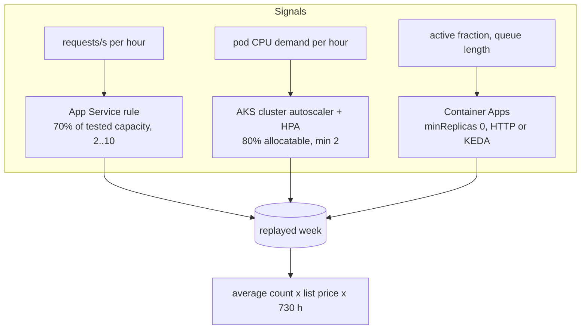

# Pattern 2: Autoscale elastic apps

**Module:** [`src/finops/patterns/p02_autoscale.py`](../../src/finops/patterns/p02_autoscale.py) ·
**Tests:** [`tests/test_p02_autoscale.py`](../../tests/test_p02_autoscale.py) ·
**Run:** `finops pattern p02`

Rightsizing fixes the size of one machine. Autoscaling fixes the **count**: a web tier pinned at
six instances for a Monday-morning peak pays for six instances at three in the morning too. This
pattern replays one measured week of demand, hour by hour, through the scaling rule you would
actually deploy, and prices the result.



## 1. Problem

Fixed capacity is sized for the peak and paid for around the clock. Traffic for most business
apps follows the working day and the working week, so the average need is often half the peak or
less. Three Azure surfaces solve it in different ways: App Service autoscale rules, the AKS
cluster autoscaler with the Horizontal Pod Autoscaler (and KEDA for event-driven work), and
Container Apps, which can scale all the way to zero.

## 2. Signals and data sources

| Signal | Azure source | Synthetic stand-in |
|---|---|---|
| Requests per second, hourly | App Service `Requests` metric, Application Insights `requests` | `data/metrics/web-traffic.json` (`<plan>.rps`) |
| Tested capacity per instance | Load test result recorded on the plan | `rps_per_instance` property in the inventory |
| Pod CPU demand, hourly | Container Insights `KubePodInventory` + `Perf` | `data/metrics/web-traffic.json` (`<cluster>.pod_cores`) |
| Container App active share and requests | `ContainerAppConsoleLogs`, `Requests` metric | `active_fraction`, `monthly_requests` |
| Current settings | Resource Graph (`autoscale`, `node_count`, `min_replicas`) | `data/inventory/resources.json` |

## 3. Detection logic

The App Service rule is the formula autoscale enforces, written down so it can be replayed:

<!-- code: src/finops/patterns/p02_autoscale.py::instances_needed -->
```python
def instances_needed(rps: float, per_instance: float, target: float = APP_TARGET, lo: int = APP_MIN, hi: int = APP_MAX) -> int:
    return min(hi, max(lo, math.ceil(rps / (per_instance * target))))
```
<!-- /code -->

<!-- code: src/finops/patterns/p02_autoscale.py::replay_app_service -->
```python
def replay_app_service(rps_week: list[float], per_instance: float) -> tuple[float, int]:
    """Average instances over the week and the peak count."""
    counts = [instances_needed(x, per_instance) for x in rps_week]
    return sum(counts) / len(counts), max(counts)
```
<!-- /code -->

AKS gets the same treatment with nodes instead of instances:

<!-- code: src/finops/patterns/p02_autoscale.py::replay_aks -->
```python
def replay_aks(cores_week: list[float]) -> tuple[float, int]:
    nodes = [max(AKS_MIN, math.ceil(c / (S.AKS_NODE_CORES * S.AKS_TARGET))) for c in cores_week]
    return sum(nodes) / len(nodes), max(nodes)
```
<!-- /code -->

Container Apps are priced with the consumption meters: a warm replica pays the idle rate when it
is not serving and the active rate when it is.

<!-- code: src/finops/costing.py::container_app_monthly -->
```python
def container_app_monthly(min_replicas: int, vcpu: float, gib: float, active_fraction: float,
                          monthly_requests: int, book: PriceBook | None = None) -> float:
    """Consumption-profile Container App. A warm replica bills the idle rate whenever it is not
    serving, and the active rate while serving. The per-subscription monthly free grant is ignored
    (conservative: real bills for tiny apps are lower)."""
    book = book or default_book()
    active_s = SECONDS_PER_MONTH * active_fraction * max(min_replicas, 1 if active_fraction else 0)
    idle_s = SECONDS_PER_MONTH * (1 - active_fraction) * min_replicas
    active = active_s * (vcpu * book.price("containerapps.vcpu_active_second") + gib * book.price("containerapps.gib_active_second"))
    idle = idle_s * (vcpu * book.price("containerapps.vcpu_idle_second") + gib * book.price("containerapps.gib_idle_second"))
    reqs = monthly_requests / 1e6 * book.price("containerapps.requests_million")
    return active + idle + reqs
```
<!-- /code -->

## 4. Decision rule

- **App Service:** plans with a fixed count and a web traffic profile get a rule of minimum 2
  (zone and update safety), maximum 10, scale out above 70% CPU for 10 minutes, scale in below
  35% with a longer cooldown (15 minutes) so it does not flap.
- **AKS:** a fixed node pool gets the cluster autoscaler with minimum 2 and maximum of the observed
  peak plus 2 nodes of headroom, plus an HPA on the workload at 70% CPU.
- **Container Apps:** non-production apps with a warm replica go to `minReplicas: 0`, with an HTTP
  rule or a KEDA queue rule. Production apps with a latency objective keep their warm replica;
  that is a decision, not an oversight, and the report says so.

## 5. Worked example

<!-- output: pattern p02 -->
```text
== p02-autoscale: Autoscale elastic apps (App Service, AKS, Container Apps)
  aks-dispatch-prod       cluster autoscaler 6 fixed -> 2..8 (avg 3.26)      $840.96 ->    $456.35  save    $384.61/mo  [high/low]
  asp-portal-prod         autoscale 6 fixed -> 2..10 (avg 2.88)              $678.90 ->    $325.98  save    $352.92/mo  [high/low]
  ca-dispatch-dev-api     scale to zero: minReplicas 2 -> 0 (HTTP)            $67.19 ->     $14.21  save     $52.98/mo  [high/low]
  ca-dispatch-dev-worker  scale to zero: minReplicas 1 -> 0 (KEDA queue)      $29.17 ->      $7.88  save     $21.29/mo  [high/low]
  skip ca-eta-assistant: prod app with a latency objective; keeps minReplicas=1 by design
  note: replayed one week of hourly demand; monthly = weekly average x 730 h
  TOTAL: 4 finding(s), $1,616.22 -> $804.42, save $811.80/mo (50.2%), $9,741.60/yr
```
<!-- /output -->

The App Service finding carries the exact autoscale profile it would deploy (shortened here):

```text
capacity: minimum 2, default 2, maximum 10
scale out: CpuPercentage > 70 (avg, 10 min window), +1 instance, cooldown 5 min
scale in:  CpuPercentage < 35 (avg, 10 min window), -1 instance, cooldown 15 min
```

## 6. Savings math

- `asp-portal-prod`: P1v3 is $113.15 a month per instance. Six fixed instances cost $678.90.
  The replayed week averages 2.88 instances (minimum 2, peak 6), so $325.98. Saving **$352.92**.
- `aks-dispatch-prod`: D4s_v5 nodes are $140.16 a month each. Six fixed nodes cost $840.96; the
  replay averages 3.26 nodes, $456.35. Saving **$384.61**.
- `ca-dispatch-dev-api`: two replicas idle 82% of the time cost $67.19. At zero minimum it pays
  only for the 18% active time, $14.21. Saving **$52.98**.
- `ca-dispatch-dev-worker`: queue-driven, active 10% of the time. $29.17 to $7.88, saving **$21.29**.

Pattern total: **$811.80 a month (50.2%)**. The monthly figure is the weekly average count times
730 hours. The Container Apps free monthly grant is ignored, so real bills for small apps are lower.

## 7. Risks and guardrails

| Risk | Guardrail |
|---|---|
| Scale-out too slow for a burst | Minimum 2 instances, 70% target leaves 30% headroom while new instances warm up |
| Flapping (out, in, out) | Scale-in threshold is half the scale-out one, with a 3x longer cooldown |
| Cold start at zero | Only non-prod and queue workers go to zero; prod keeps a warm replica |
| Pod disruption on node scale-in | HPA scale-down stabilization of 300 s; PodDisruptionBudgets stay with the app team |
| Max too low for a real peak | AKS max = observed peak + 2 nodes; App Service max 10 against a replayed peak of 6 |

## 8. Automation and approval flow

The agent emits the change as a ready command (for example
`az monitor autoscale create ... --min-count 2 --max-count 10 --count 2` and
`az aks nodepool update ... --enable-cluster-autoscaler --min-count 2 --max-count 8`) inside a
dry-run plan. Each step is reversible ("delete the autoscale setting and set the fixed count"), so
one approver is enough. In practice the change lands as an IaC pull request, which is the approval.

## 9. IaC and policy

The repo ships an opt-in autoscale example (`deploy_autoscale_demo = false` by default, because a
plan bills while it exists) on the smallest settings: a P0v3 plan scaling 1 to 2.

<!-- code: infra/terraform/main.tf::resource "azurerm_monitor_autoscale_setting" -->
```hcl
resource "azurerm_monitor_autoscale_setting" "demo" {
  count               = var.deploy_autoscale_demo ? 1 : 0
  name                = "autoscale-${local.short}-${local.suffix}"
  resource_group_name = azurerm_resource_group.this.name
  location            = var.location
  target_resource_id  = azurerm_service_plan.demo[0].id
  tags                = local.tags

  profile {
    name = "follow-demand"
    capacity {
      default = 1
      minimum = 1
      maximum = 2
    }
    rule {
      metric_trigger {
        metric_name        = "CpuPercentage"
        metric_resource_id = azurerm_service_plan.demo[0].id
        time_grain         = "PT1M"
        statistic          = "Average"
        time_window        = "PT10M"
        time_aggregation   = "Average"
        operator           = "GreaterThan"
        threshold          = 70
      }
      scale_action {
        direction = "Increase"
        type      = "ChangeCount"
        value     = "1"
        cooldown  = "PT5M"
      }
    }
    rule {
      metric_trigger {
        metric_name        = "CpuPercentage"
        metric_resource_id = azurerm_service_plan.demo[0].id
        time_grain         = "PT1M"
        statistic          = "Average"
        time_window        = "PT10M"
        time_aggregation   = "Average"
        operator           = "LessThan"
        threshold          = 35
      }
      scale_action {
        direction = "Decrease"
        type      = "ChangeCount"
        value     = "1"
        cooldown  = "PT15M"
      }
    }
  }
}
```
<!-- /code -->

The Bicep twin is `resource autoscale` in [`infra/bicep/modules/guardrails.bicep`](../../infra/bicep/modules/guardrails.bicep).
The AKS side is a manifest the module generates (`hpa_manifest`) and, for queue workers, a KEDA
`ScaledObject` (`keda_scaledobject`) with workload identity instead of a connection string.

## 10. Observability and KQL

- [`queries/kql/app-service-cpu.kql`](../../queries/kql/app-service-cpu.kql): instance count and CPU
  per plan over time, to check the rule after rollout.
- [`queries/kql/container-apps-requests.kql`](../../queries/kql/container-apps-requests.kql):
  replica count against requests per Container App, the input for scale-to-zero:

<!-- code: queries/kql/container-apps-requests.kql -->
```kusto
// Patterns 2 and 8: requests and replicas per Container App per hour. Zero requests with replicas > 0
// is the warm-but-idle case.
AzureMetrics
| where TimeGenerated > ago(30d)
| where ResourceProvider == 'MICROSOFT.APP' and MetricName in ('Requests', 'Replicas')
| summarize total = sum(Total), maxv = max(Maximum) by Resource, MetricName, bin(TimeGenerated, 1h)
| evaluate pivot(MetricName, sum(total))
```
<!-- /code -->

- [`queries/arg/container-apps-warm-replicas.kql`](../../queries/arg/container-apps-warm-replicas.kql):
  every Container App with `minReplicas > 0`, the inventory side of the same check.

## 11. Mapping to Azure tools

| Need | Azure tool |
|---|---|
| Find fixed-count resources | Azure Resource Graph, Advisor ("enable autoscale" style recommendations) |
| Rules | Azure Monitor autoscale (App Service, VMSS), AKS cluster autoscaler, HPA, KEDA, Container Apps scale rules |
| Measure | Azure Monitor metrics, Container Insights, Application Insights |
| Prove the saving | Cost Management daily cost by resource, before and after; the instance-count metric |

## 12. Limitations

- One synthetic week is replayed; seasonal peaks (holidays, month end) need a longer window.
- Scale-out lag is not simulated hour to hour; the 70% target is the buffer for it.
- AKS saving assumes pods pack evenly; real bin packing and daemonsets reduce it.
- Free grants and per-request Container Apps pricing beyond the snapshot meters are ignored.

## 13. Interview talking points

- "I don't argue autoscale in the abstract. I replay a real week of demand through the exact rule
  and show the average count. Here 6 fixed web instances average 2.88."
- "Scale-in is where autoscale goes wrong, so it has a lower threshold and a longer cooldown."
- "Scale to zero is a product decision. Dev and queue workers go to zero; the customer-facing
  assistant keeps one warm replica because of its latency objective."
- "About $812 a month on this estate, and every change is reversible."
