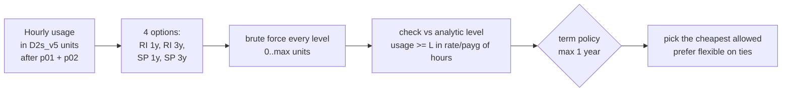

# Pattern 3: Reservations and savings plans for the steady baseline

**Module:** [`src/finops/patterns/p03_commitments.py`](../../src/finops/patterns/p03_commitments.py) ·
**Tests:** [`tests/test_p03_commitments.py`](../../tests/test_p03_commitments.py) ·
**Run:** `finops pattern p03 --evidence`

Pay-as-you-go is the most expensive way to run something that never turns off. A commitment
(a reservation for a specific VM family and region, or a compute savings plan that floats across
services) trades flexibility for a lower hourly rate. The hard part is the **size** of the
commitment: too small leaves money on the table, too big pays for hours nobody uses.



## 1. Problem

The D-series fleet in `lk-prod` never drops below 13 normalized D2s_v5 units, averages 17.04 and
peaks at 29. Committing to the average looks reasonable and is wrong: the hours above the floor are
spiky, so committed units above a certain level sit idle too often to pay off. A FinOps team needs
the level, the option and the break-even, and needs to buy **after** rightsizing and autoscaling,
not before.

## 2. Signals and data sources

| Signal | Azure source | Synthetic stand-in |
|---|---|---|
| Hourly normalized usage per family | Cost Management usage details or the FOCUS export (`ConsumedQuantity` by hour), normalized with instance size flexibility ratios | `data/metrics/compute-usage.json` |
| Commitment rates | Retail Prices API (`priceType` Reservation, savings plan price on the consumption meter) | `data/pricing/retail-prices-snapshot.json` |
| Existing coverage | `CommitmentDiscountId` on FOCUS rows | `queries/kql/commitment-coverage.kql` |

Instance size flexibility is what makes the unit work: a D2s_v5 reservation covers one D2, half a
D4 or a quarter of a D8 in the same family and region.

## 3. Detection logic

The cost of committing to a level `L` for one hour is `L x commitment rate` plus any usage above
`L` at pay-as-you-go:

<!-- code: src/finops/patterns/p03_commitments.py::cost_at -->
```python
def cost_at(usage: list[float], level: int, rate: float, payg: float) -> float:
    return sum(level * rate + max(0.0, u - level) * payg for u in usage)
```
<!-- /code -->

Every level is tried, and the answer is checked against the closed-form rule (a unit is worth
buying if it is in use for at least `rate / payg` of the hours):

<!-- code: src/finops/patterns/p03_commitments.py::analytic_level -->
```python
def analytic_level(usage: list[float], rate: float, payg: float) -> int:
    """Largest level L such that usage >= L in at least rate/payg of the hours."""
    need = rate / payg
    n = len(usage)
    best = 0
    for lv in range(0, int(max(usage)) + 1):
        if sum(1 for u in usage if u >= lv) / n >= need:
            best = lv
    return best
```
<!-- /code -->

<!-- code: src/finops/patterns/p03_commitments.py::breakeven_months -->
```python
def breakeven_months(rate: float, payg: float, term_years: int) -> float:
    """If the workload disappears after m months, savings so far equal the unused remainder when
    m = term x rate / payg."""
    return round(12 * term_years * rate / payg, 1)
```
<!-- /code -->

## 4. Decision rule

1. Normalize hourly usage to D2s_v5 units after rightsizing (p01) and autoscaling (p02).
2. For each option, the optimal level is the cost minimum over all levels; it must agree with the
   analytic level (a test enforces this).
3. Terms longer than `MAX_TERM_YEARS = 1` are excluded unless the platform roadmap is signed off.
4. Pick the cheapest allowed option; on a tie, prefer the flexible savings plan.
5. Purchases need a **finance** approver in addition to the FinOps approver, and the plan is marked
   irreversible.

## 5. Worked example

<!-- output: pattern p03 -->
```text
== p03-commitments: Reservations and savings plans for the steady baseline
  D-series fleet (lk-prod)  buy reservation-1y for 13 x D2s_v5 units         $1,194.09 ->    $845.30  save    $348.79/mo  [high/low]
  note: reservation-1y    38.3% off  commit 13 units  month    $845.30  break-even use 62%  break-even 7.4 months
  note: reservation-3y    60.5% off  commit 15 units  month    $624.68  break-even use 40%  break-even 14.2 months
  note: savings-plan-1y   31.0% off  commit 13 units  month    $911.66  break-even use 69%  break-even 8.3 months
  note: savings-plan-3y   53.0% off  commit 15 units  month    $703.33  break-even use 47%  break-even 16.9 months
  note: policy max term 1y -> reservation-1y; usage min/avg/max 13.0/17.04/29.0 units
  TOTAL: 1 finding(s), $1,194.09 -> $845.30, save $348.79/mo (29.2%), $4,185.48/yr
```
<!-- /output -->

The 3-year reservation is the cheapest line ($624.68 a month at 15 units) but it is excluded by the
term policy, so the pick is a 1-year reservation for 13 units. Thirteen is exactly the usage floor:
above that level, units are busy less than 62% of the hours, which is the break-even utilization.

## 6. Savings math

- Pay-as-you-go D2s_v5 is $0.096 an hour. Average usage 17.04 units x $0.096 x 730 h = **$1,194.09**
  a month.
- A 1-year reservation for D2s_v5 lists at $519 for the term, $519 / 8,760 h = $0.05925 an hour,
  38.3% below pay-as-you-go.
- 13 units are reserved, and the overflow above 13 stays on pay-as-you-go: **$845.30** a month.
- Saving **$348.79 a month (29.2%), $4,185.48 a year**.
- Break-even: $0.05925 / $0.096 = 61.7% utilization, or 12 x 0.617 = **7.4 months** if the workload
  disappeared completely.

## 7. Risks and guardrails

| Risk | Guardrail |
|---|---|
| Committing to waste | Runs after p01 and p02; the input is the post-optimization usage |
| Workload shrinks or moves | Level is the floor, not the average; break-even months reported for each option |
| Wrong scope | Shared scope across subscriptions in the billing account, so idle units float to other users |
| Lock-in to a family | Savings plan shown side by side; it wins ties |
| Unreviewed purchase | Plan is irreversible, needs two distinct approvers and one with the `finance` role |

## 8. Automation and approval flow

The agent never buys anything. The plan step is a comment for the finance team
(`# finance purchase: reservation-1y x13 D2s_v5 (portal or az reservations), scope shared`) and its
rollback says what is realistic: "exchange or cancel within the reservation policy limits (fees
may apply)". After purchase, the coverage query below is the check that it landed.

## 9. IaC and policy

Commitments are a billing object, not infrastructure, so they are bought in the portal or with
`az reservations`, never from Terraform. What IaC does own is the **guardrail** around them: the
budget and action group in [`infra/terraform/main.tf`](../../infra/terraform/main.tf) alert when
spend moves away from plan, which is often the first sign that coverage dropped.

## 10. Observability and KQL

<!-- code: queries/kql/commitment-coverage.kql -->
```kusto
// Pattern 3: hourly commitment coverage for the D-series fleet from the FOCUS export (FocusCost_CL).
// Covered = rows with a CommitmentDiscountId; the uncovered on-demand floor is the next purchase.
FocusCost_CL
| where ChargePeriodStart > ago(30d)
| where ServiceName == 'Virtual Machines' and x_SkuMeterName has_any ('D2s v5', 'D4s v5', 'D8s v5')
| extend covered = isnotempty(CommitmentDiscountId)
| summarize onDemandHours = sumif(ConsumedQuantity, not(covered)), coveredHours = sumif(ConsumedQuantity, covered),
            onDemandCost = sumif(EffectiveCost, not(covered)) by hour = bin(ChargePeriodStart, 1h)
| extend coveragePct = round(100.0 * coveredHours / (coveredHours + onDemandHours), 1)
| summarize p10OnDemandHours = percentile(onDemandHours, 10), avgCoverage = avg(coveragePct), onDemandCost = sum(onDemandCost)
```
<!-- /code -->

Track two numbers monthly: **coverage** (share of eligible hours covered) and **utilization**
(share of committed hours used). Cost Management shows both for reservations and savings plans.

## 11. Mapping to Azure tools

| Step | Azure tool |
|---|---|
| Recommendation | Advisor reservation and savings plan recommendations (7, 30 or 60-day lookback) |
| Purchase | Azure portal Reservations, `az reservations`, savings plan purchase blade |
| Coverage and utilization | Cost Management reservation utilization, FOCUS `CommitmentDiscountId` |
| Allocation | Amortized cost view, so each team sees its share of the commitment |

## 12. Limitations

- One family (Dsv5, Linux) and one region; a real portfolio has several, and savings plans are
  optimized across them together.
- The usage window is one synthetic month; a purchase deserves at least 60 days and a look at the
  roadmap.
- Exchange and refund rules change; the module does not model fees.

## 13. Interview talking points

- "Commit to the floor, not the average. Above the break-even utilization, extra units cost more
  than they save."
- "I brute-force the level and check it against the analytic rule. When they agree, I trust it."
- "Here a 3-year term would save more, but policy says one year until the platform roadmap is
  signed off, so the pick is 13 units for one year: $348.79 a month, break-even in 7.4 months."
- "Buy after rightsizing and autoscaling, never before."
