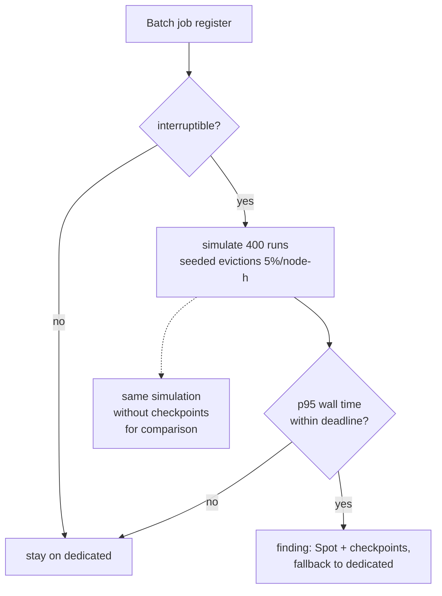

# Pattern 4: Spot capacity for interruptible work

**Module:** [`src/finops/patterns/p04_spot.py`](../../src/finops/patterns/p04_spot.py) ·
**Tests:** [`tests/test_p04_spot.py`](../../tests/test_p04_spot.py) ·
**Run:** `finops pattern p04 --evidence`

Spot capacity is spare Azure capacity sold at a deep discount, with one catch: Azure can take it
back with about 30 seconds of notice. For batch jobs that can stop and resume, that catch costs a
little rework. For jobs that cannot, it costs a missed deadline. This pattern decides which is
which by **simulating** evictions instead of hoping.



## 1. Problem

Batch and training work (route optimization, invoice rendering, model training) runs on fleets of
VMs for a few hours at a time. On pay-as-you-go that is full price for work that does not care
which machine it ran on. Spot nodes in Azure Batch, or a VM Scale Set with Spot priority, cost
60% to 70% less here, but an evicted node loses everything since its last checkpoint and needs
minutes to come back.

## 2. Signals and data sources

| Signal | Azure source | Synthetic stand-in |
|---|---|---|
| Job shape: nodes, hours per run, runs per month, deadline | Batch job history, scheduler config | `data/batch/jobs.json` |
| Interruptible or not | Owner's answer, recorded as a tag | `interruptible` field |
| Spot vs pay-as-you-go price | Retail Prices API (`Spot` meters) | list-price snapshot |
| Eviction rate | Portal "eviction rate" band per size and region; activity log for real evictions | **ASSUMPTION** 5% per node-hour |

## 3. Detection logic

Each run is replayed node by node. When a node is evicted, the work since its last checkpoint is
redone and the replacement takes `RESTART_MINUTES` to arrive:

<!-- code: src/finops/patterns/p04_spot.py::simulate_run -->
```python
def simulate_run(rng: random.Random, nodes: int, hours: float, checkpoint_min: float, rate: float = EVICTION_RATE_PER_HOUR) -> SimResult:
    """Replay one run. Each node owns 1/nodes of the work. On eviction the node loses the work
    since its last checkpoint (all of it if checkpoint_min == 0) and pays a restart delay."""
    step = 1 / 60  # minute resolution
    p = rate * step
    total_hours, evictions, wall = 0.0, 0, 0.0
    for _ in range(nodes):
        done, since_ckpt, t = 0.0, 0.0, 0.0
        while done < hours:
            t += step
            done += step
            since_ckpt += step
            if checkpoint_min and since_ckpt * 60 >= checkpoint_min:
                since_ckpt = 0.0
            if rng.random() < p and done < hours:
                evictions += 1
                done -= since_ckpt if checkpoint_min else done
                since_ckpt = 0.0
                t += RESTART_MINUTES / 60
        total_hours += t
        wall = max(wall, t)
    return SimResult(total_hours, evictions, wall)
```
<!-- /code -->

<!-- code: src/finops/patterns/p04_spot.py::evaluate -->
```python
def evaluate(job: dict[str, Any], rate: float = EVICTION_RATE_PER_HOUR, checkpoint: bool = True) -> dict[str, Any]:
    book = default_book()
    rng = random.Random(SEED)
    sims = [simulate_run(rng, job["nodes"], job["hours_per_run"], job["checkpoint_minutes"] if checkpoint else 0, rate) for _ in range(SIMULATED_RUNS)]
    payg = book.price(vm_key(job["size"]))
    spot = book.price(vm_key(job["size"], offer="spot"))
    mean_hours = sum(s.node_hours for s in sims) / len(sims)
    walls = [s.wall_hours for s in sims]
    return {
        "payg_monthly": round(job["nodes"] * job["hours_per_run"] * payg * job["runs_per_month"], 2),
        "spot_monthly": round(mean_hours * spot * job["runs_per_month"], 2),
        "rework_pct": round(100 * (mean_hours / (job["nodes"] * job["hours_per_run"]) - 1), 1),
        "evictions_per_run": round(sum(s.evictions for s in sims) / len(sims), 2),
        "wall_p95_hours": round(percentile(walls, 95), 2),
        "deadline_hours": job["deadline_hours"],
        "spot_discount_pct": round(100 * (1 - spot / payg), 1),
    }
```
<!-- /code -->

Eviction handling is real code, not only a cost model. A worker that gets the Scheduled Events
`Preempt` notice saves a checkpoint and exits; the next node resumes from it:

<!-- code: src/finops/patterns/p04_spot.py::run_resumable -->
```python
def run_resumable(job: str, steps: list[Callable[[Any], Any]], store: CheckpointStore, preempt_at: set[int] | None = None,
                  checkpoint_every: int = 1, initial: Any = 0) -> Any:
    """Run ``steps`` in order, resuming from the store. ``preempt_at`` simulates an Azure Scheduled
    Events ``Preempt`` notice arriving before the given step: the worker checkpoints and exits."""
    start, state = store.load(job)
    if state is None:
        state = initial
    for i in range(start, len(steps)):
        if preempt_at and i in preempt_at:
            preempt_at.discard(i)
            store.save(job, i, state)  # the ~30 s notice is enough to flush a small checkpoint
            raise Preempted(f"preempted before step {i}")
        state = steps[i](state)
        if (i + 1) % checkpoint_every == 0:
            store.save(job, i + 1, state)
    store.save(job, len(steps), state)
    return state
```
<!-- /code -->

A test runs the same job with and without preemptions and checks the results are identical.

## 4. Decision rule

1. Non-interruptible jobs (here, the month-end financial close) never move.
2. Simulate 400 runs per job with seed 4 at the assumed eviction rate.
3. Move to Spot only if the **p95** wall-clock time with checkpoints is within the job deadline.
4. Pool configuration: Spot priority, eviction policy `Delete`, fallback to dedicated nodes.
5. Mark the saving as an **estimate**, because it rests on the eviction-rate assumption.

## 5. Worked example

<!-- output: pattern p04 -->
```text
== p04-spot: Spot capacity for interruptible batch work
  pool:route-optimizer  Spot nodes, checkpoint every 15 min (10x D8s_v5)     $345.60 ->    $111.96  save    $233.64/mo  [medium/low] (estimate)
  pool:eta-model-train  Spot nodes, checkpoint every 30 min (6x E4s_v5)      $60.48 ->     $24.22  save     $36.26/mo  [medium/low] (estimate)
  pool:invoice-render   Spot nodes, checkpoint every 10 min (4x D4s_v5)      $46.08 ->     $14.92  save     $31.16/mo  [medium/low] (estimate)
  skip month-end-close: not interruptible (financial close must finish in one pass); stays on pay-as-you-go
  note: ASSUMPTION eviction rate 5%/node-hour, restart 6 min, 400 simulated runs per job (seed 4)
  note: pool:route-optimizer: rework 1.7% with checkpoints vs 9.3% without; p95 wall 3.43 h vs 7.32 h
  note: pool:invoice-render: rework 1.6% with checkpoints vs 6.3% without; p95 wall 2.25 h vs 3.88 h
  note: pool:eta-model-train: rework 2.1% with checkpoints vs 14.5% without; p95 wall 5.7 h vs 13.57 h
  TOTAL: 3 finding(s), $452.16 -> $151.10, save $301.06/mo (66.6%), $3,612.72/yr
```
<!-- /output -->

Checkpointing is what makes this safe. Without it, `eta-model-train` redoes 14.5% of its work and
its p95 completion is 13.57 hours, past its 12-hour deadline. With 30-minute checkpoints, rework
is 2.1% and p95 is 5.7 hours.

## 6. Savings math

`route-optimizer`: 10 D8s_v5 nodes x 3 h x 30 runs = 900 node-hours a month.

- Pay-as-you-go: 900 x $0.384 = **$345.60**.
- Spot is 68.1% cheaper in the snapshot. With 1.7% rework the simulation averages about 915 node
  hours, which comes to **$111.96**.
- Saving **$233.64** a month (estimate).

Pattern total across the three pools: **$301.06 a month (66.6%), $3,612.72 a year (estimate)**.

## 7. Risks and guardrails

| Risk | Guardrail |
|---|---|
| Evictions worse than assumed | Rate set at the pessimistic end; re-run with the measured rate (`evaluate(job, rate=...)`) |
| Deadline missed | p95 wall time must fit the deadline, not the average |
| No capacity at all | Fallback to dedicated nodes in the same pool definition |
| Lost work | Checkpoints to blob storage every 10 to 30 minutes, flushed on the Preempt notice |
| Critical job on Spot | `interruptible` is the owner's call; false means the job is never proposed |

## 8. Automation and approval flow

The plan step changes pool priority through the job's IaC or Batch pool definition (the agent
emits "change via infrastructure-as-code pull request"). It is reversible: switch the pool back to
dedicated. One approver, normally the job owner, is enough.

## 9. IaC and policy

Spot is a setting on the scale set or pool. An illustrative Terraform fragment for a scale set
(not deployed by this repo):

```hcl
resource "azurerm_linux_virtual_machine_scale_set" "batch" {
  # ...
  sku             = "Standard_D8s_v5"
  priority        = "Spot"
  eviction_policy = "Delete"
  max_bid_price   = -1 # pay up to the current pay-as-you-go price, never evicted for price
}
```

`max_bid_price = -1` means evictions happen only for capacity, never for price. The
`allowed-vm-skus` policy still applies to Spot sizes.

## 10. Observability and KQL

- [`queries/arg/spot-ready-scale-sets.kql`](../../queries/arg/spot-ready-scale-sets.kql): scale
  sets still on regular priority, with the owner's `interruptible` tag.
- [`queries/kql/spot-evictions.kql`](../../queries/kql/spot-evictions.kql): real evictions per day
  from the activity log, to replace the assumption:

<!-- code: queries/kql/spot-evictions.kql -->
```kusto
// Pattern 4: evictions per scale set per day, from the activity log (Spot eviction is logged as a
// Preempt / deallocate operation by the platform). Compare with the eviction-rate assumption.
AzureActivity
| where TimeGenerated > ago(30d)
| where OperationNameValue has 'virtualMachineScaleSets' and ActivitySubstatusValue has 'Preempt'
     or Properties has 'SpotVmEviction'
| summarize evictions = count() by scaleSet = tostring(split(_ResourceId, '/')[8]), day = bin(TimeGenerated, 1d)
| order by day asc
```
<!-- /code -->

## 11. Mapping to Azure tools

| Step | Azure tool |
|---|---|
| Price and eviction band | Spot pricing page and the portal's eviction-rate column per size |
| Run it | Azure Batch Spot nodes, VMSS Spot priority, AKS Spot node pools |
| Eviction notice | Azure Scheduled Events (`Preempt`) from the instance metadata endpoint |
| Measure | Activity log, Batch pool metrics, Cost Management by pool |

## 12. Limitations

- The eviction process is a constant-rate random model; real evictions cluster in time and region.
- Restart time is fixed at 6 minutes; large images or data downloads make it longer.
- Spot prices move; the snapshot is one point in time.

## 13. Interview talking points

- "I don't put a job on Spot because it is cheap. I put it on Spot when the p95 completion time
  with evictions still meets the deadline."
- "Checkpointing is the whole pattern. Without it the training job misses its deadline; with it,
  rework is 2%."
- "The month-end close stays on dedicated nodes. Knowing what not to move is part of the job."
- "About $301 a month here, clearly marked as an estimate, with the eviction rate as the one
  assumption to measure."
