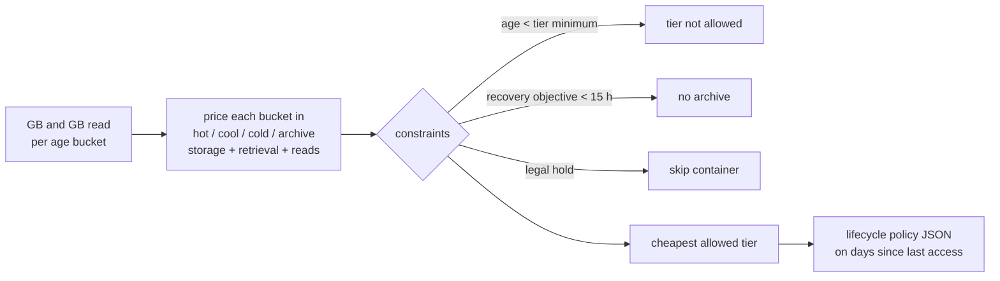

# Pattern 5: Storage lifecycle tiering

**Module:** [`src/finops/patterns/p05_storage_tiering.py`](../../src/finops/patterns/p05_storage_tiering.py) ·
**Tests:** [`tests/test_p05_storage.py`](../../tests/test_p05_storage.py) ·
**Run:** `finops pattern p05 --evidence`

Data lakes grow forever and almost nobody reads last year's telemetry. Blob storage has four
access tiers with very different prices for storing versus reading. This pattern prices every
age bucket of every container in every tier it is allowed to use, picks the cheapest, and writes
the lifecycle policy that makes it happen automatically.



## 1. Problem

Everything lands in the hot tier, and hot is the most expensive place to keep data nobody reads.
The cheaper tiers charge for reading and have minimum retention periods (30, 90 and 180 days), and
archive is offline: reading it means a rehydration of up to 15 hours. Picking a tier by gut feel
either saves little or creates a surprise retrieval bill. The decision has to include read traffic.

## 2. Signals and data sources

| Signal | Azure source | Synthetic stand-in |
|---|---|---|
| GB per container by days since last access | Blob inventory report with `LastAccessTime`, or storage analytics | `data/storage/containers.json` |
| GB read per bucket | `StorageBlobLogs` (diagnostic setting) | same file, `read_gb` |
| Recovery objective, legal hold | Data owner, immutability policy | `max_rehydrate_hours`, `legal_hold` |
| Tier prices | Retail Prices API (capacity, retrieval, read operations) | list-price snapshot |

Last-access-time tracking must be enabled on the account; the storage account in this repo's IaC
turns it on.

## 3. Detection logic

A bucket's monthly cost in a tier is storage plus retrieval plus read operations:

<!-- code: src/finops/patterns/p05_storage_tiering.py::bucket_cost -->
```python
def bucket_cost(tier: str, gb: float, read_gb: float) -> float:
    book = default_book()
    store = book.price(f"blob.{tier}.gb_month") * gb
    retrieval = 0.0 if tier == "hot" else book.price(f"blob.{tier}.retrieval_gb") * read_gb
    ops = read_gb * 1024 / AVG_READ_MB / 10_000 * book.price(f"blob.{tier}.read_10k")
    return store + retrieval + ops
```
<!-- /code -->

<!-- code: src/finops/patterns/p05_storage_tiering.py::choose_tier -->
```python
def choose_tier(bucket: dict[str, Any], rehydrate_hours: float) -> tuple[str, dict[str, float]]:
    costs = {}
    for t in TIERS:
        if bucket["min_age"] < MIN_DAYS[t]:
            continue
        if t == "archive" and rehydrate_hours < ARCHIVE_REHYDRATE_HOURS:
            continue
        costs[t] = round(bucket_cost(t, bucket["gb"], bucket["read_gb"]), 2)
    return min(costs, key=lambda k: (costs[k], TIERS.index(k))), costs
```
<!-- /code -->

The chosen tiers become a management policy, one rule per container:

<!-- code: src/finops/patterns/p05_storage_tiering.py::lifecycle_policy -->
```python
def lifecycle_policy(plan: dict[str, dict[int, str]]) -> dict[str, Any]:
    """Build a management policy: one rule per container, tiering on days since last access."""
    rules = []
    for container, by_age in sorted(plan.items()):
        actions: dict[str, Any] = {}
        for age, tier in sorted(by_age.items()):
            if tier == "hot":
                continue
            key = {"cool": "tierToCool", "cold": "tierToCold", "archive": "tierToArchive"}[tier]
            actions.setdefault(key, {"daysAfterLastAccessTimeGreaterThan": age})  # earliest age per tier
        if not actions:
            continue
        if "tierToCool" in actions:
            actions["enableAutoTierToHotFromCool"] = True
        rules.append(
            {
                "name": f"tier-{container}",
                "enabled": True,
                "type": "Lifecycle",
                "definition": {
                    "filters": {"blobTypes": ["blockBlob"], "prefixMatch": [f"{container}/"]},
                    "actions": {"baseBlob": actions},
                },
            }
        )
    return {"policy": {"rules": rules}}
```
<!-- /code -->

## 4. Decision rule

1. A tier is allowed for a bucket only if the bucket is older than the tier's minimum retention
   (cool 30, cold 90, archive 180 days), so no early-deletion charge applies.
2. Archive is allowed only if the container's recovery objective is at least 15 hours.
3. Containers under legal hold are skipped until compliance signs off.
4. The cheapest allowed tier wins; ties go to the warmer tier.
5. Tier on **days since last access**, not since creation, and turn on auto-tier back to hot from
   cool when something is read again.

## 5. Worked example

<!-- output: pattern p05 --evidence -->
```text
== p05-storage-tiering: Storage lifecycle tiering (hot -> cool -> cold -> archive)
  stlkdatalake/raw-telemetry  lifecycle 0d+:hot / 30d+:cool / 90d+:cold / 180d+:archive   $1,905.39 ->    $421.79  save  $1,483.60/mo  [high/medium] (estimate)
  stlkdatalake/shipment-docs  lifecycle 0d+:hot / 30d+:cool / 90d+:cold / 180d+:cold     $500.80 ->    $140.39  save    $360.41/mo  [high/low] (estimate)
  skip audit-archive: legal hold; tier changes need compliance sign-off
  skip ml-features: every bucket is cheapest in hot (read-heavy)
  note: ASSUMPTION 4 MB per read operation; prices are the flat first tier (0.0184/GB hot)
  note: requires last-access-time tracking on the account; first transition writes are a one-off cost not shown
  TOTAL: 2 finding(s), $2,406.18 -> $562.17, save $1,844.01/mo (76.6%), $22,128.12/yr
  p05-57493bab stlkdatalake/raw-telemetry
    evidence: {"buckets": [{"gb": 4200, "min_age": 0, "monthly_by_tier": {"hot": 78.2}, "read_gb": 9000, "tier": "hot"}, {"gb": 11800, "min_age": 30, "monthly_by_tier": {"cool": 124.15, "hot": 217.18}, "read_gb": 600, "tier": "cool"}, {"gb": 26500, "min_age": 90, "monthly_by_tier": {"cold": 96.7, "cool": 265.41, "hot": 487.6}, "read_gb": 40, "tier": "cold"}, {"gb": 61000, "min_age": 180, "monthly_by_tier": {"archive": 122.74, "cold": 219.76, "cool": 610.05, "hot": 1122.4}, "read_gb": 5, "tier": "archive"}], "rehydrate_objective_hours": 48}
    change:   {"container": "raw-telemetry", "op": "lifecycle-policy"}
  p05-90f3919e stlkdatalake/shipment-docs
    evidence: {"buckets": [{"gb": 900, "min_age": 0, "monthly_by_tier": {"hot": 16.83}, "read_gb": 2600, "tier": "hot"}, {"gb": 3100, "min_age": 30, "monthly_by_tier": {"cool": 34.18, "hot": 57.07}, "read_gb": 310, "tier": "cool"}, {"gb": 7400, "min_age": 90, "monthly_by_tier": {"cold": 30.55, "cool": 75.23, "hot": 136.17}, "read_gb": 120, "tier": "cold"}, {"gb": 15800, "min_age": 180, "monthly_by_tier": {"cold": 58.83, "cool": 158.62, "hot": 290.73}, "read_gb": 60, "tier": "cold"}], "rehydrate_objective_hours": 1}
    change:   {"container": "shipment-docs", "op": "lifecycle-policy"}
  generated policy:
    {
      "policy": {
        "rules": [
          {
            "name": "tier-raw-telemetry",
            "enabled": true,
            "type": "Lifecycle",
            "definition": {
              "filters": {
                "blobTypes": [
                  "blockBlob"
                ],
                "prefixMatch": [
                  "raw-telemetry/"
                ]
              },
              "actions": {
                "baseBlob": {
                  "tierToCool": {
                    "daysAfterLastAccessTimeGreaterThan": 30
                  },
                  "tierToCold": {
                    "daysAfterLastAccessTimeGreaterThan": 90
                  },
                  "tierToArchive": {
                    "daysAfterLastAccessTimeGreaterThan": 180
                  },
                  "enableAutoTierToHotFromCool": true
                }
              }
            }
          },
          {
            "name": "tier-shipment-docs",
            "enabled": true,
            "type": "Lifecycle",
            "definition": {
              "filters": {
                "blobTypes": [
                  "blockBlob"
                ],
                "prefixMatch": [
                  "shipment-docs/"
                ]
              },
              "actions": {
                "baseBlob": {
                  "tierToCool": {
                    "daysAfterLastAccessTimeGreaterThan": 30
                  },
                  "tierToCold": {
                    "daysAfterLastAccessTimeGreaterThan": 90
                  },
                  "enableAutoTierToHotFromCool": true
                }
              }
            }
          }
        ]
      }
    }
```
<!-- /output -->

`shipment-docs` keeps its oldest bucket in **cold**, not archive, because its recovery objective is
one hour. `ml-features` stays hot because it is read so often that retrieval fees would outweigh
the storage saving. `audit-archive` is skipped for legal hold.

## 6. Savings math

For `raw-telemetry`, the 61,000 GB bucket older than 180 days costs $1,122.40 a month in hot,
$219.76 in cold and $122.74 in archive (5 GB read a month). The 26,500 GB bucket at 90+ days is
cheapest in cold ($96.70 against $487.60 in hot). Summed over all four buckets the container goes
from $1,905.39 to $421.79, saving **$1,483.60** a month.

Pattern total: **$1,844.01 a month (76.6%), $22,128.12 a year (estimate)**. It is an estimate
because the read-operation count assumes 4 MB per read, and the one-off cost of the first tier
transition (a write operation per blob) is not included.

## 7. Risks and guardrails

| Risk | Guardrail |
|---|---|
| Early-deletion charges | Bucket age must exceed the tier's minimum retention |
| Archive needed urgently | Archive excluded below a 15-hour recovery objective |
| Read-heavy data moved to cool | Read traffic is priced in; read-heavy buckets stay hot |
| Regulated data | Legal-hold containers are skipped |
| Policy too broad | Rules use `prefixMatch` per container and `blockBlob` only |
| A tiered blob gets popular again | `enableAutoTierToHotFromCool` |

## 8. Automation and approval flow

The plan step is `az storage account management-policy create --account-name stlkdatalake -g <rg>
--policy @lifecycle-policy.json`, using the generated JSON above. Containers that include archive
are marked medium risk. A management policy can be removed, but blobs already in archive need
rehydration to come back, so the data owner approves.

## 9. IaC and policy

The repo's storage account has last-access tracking on and a lifecycle policy with the same shape
(smallest settings, Standard LRS, no data):

<!-- code: infra/terraform/main.tf::resource "azurerm_storage_management_policy" -->
```hcl
resource "azurerm_storage_management_policy" "lake" {
  storage_account_id = azurerm_storage_account.lake.id

  rule {
    name    = "tier-by-last-access"
    enabled = true
    filters {
      blob_types   = ["blockBlob"]
      prefix_match = ["raw-telemetry/", "shipment-docs/"]
    }
    actions {
      base_blob {
        tier_to_cool_after_days_since_last_access_time_greater_than    = 30
        tier_to_cold_after_days_since_last_access_time_greater_than    = 90
        tier_to_archive_after_days_since_last_access_time_greater_than = 180
        auto_tier_to_hot_from_cool_enabled                             = true
      }
    }
  }
}
```
<!-- /code -->

The Bicep twin is `resource lifecycle` in [`infra/bicep/modules/guardrails.bicep`](../../infra/bicep/modules/guardrails.bicep).

## 10. Observability and KQL

- [`queries/arg/storage-without-lifecycle.kql`](../../queries/arg/storage-without-lifecycle.kql):
  accounts that cannot tier on access yet.
- [`queries/kql/blob-access-age.kql`](../../queries/kql/blob-access-age.kql): which reads hit old
  data, the input that decides cool versus archive:

<!-- code: queries/kql/blob-access-age.kql -->
```kusto
// Pattern 5: how much read traffic hits old data (StorageBlobLogs, diagnostic setting required).
StorageBlobLogs
| where TimeGenerated > ago(30d)
| where OperationName == 'GetBlob'
| extend container = tostring(split(Uri, '/')[3])
| summarize reads = count(), read_gb = sum(ResponseBodySize) / 1e9 by AccountName, container
```
<!-- /code -->

## 11. Mapping to Azure tools

| Step | Azure tool |
|---|---|
| Inventory and age | Blob inventory, Storage insights, Resource Graph for account settings |
| Reads | `StorageBlobLogs` in Log Analytics |
| Apply | Lifecycle management policy (portal, CLI, Terraform, Bicep) |
| Recommend | Advisor storage recommendations; Cost Management by meter (capacity vs transactions) |
| Enforce | Azure Policy can audit accounts without last-access tracking |

## 12. Limitations

- Prices are the flat first tier of each meter; large volumes get lower rates.
- Read operations are estimated from GB read at 4 MB each.
- Snapshots, versions and premium block blobs are not modeled.
- Bucket boundaries are fixed at 0, 30, 90 and 180 days.

## 13. Interview talking points

- "Tiering is a read-traffic decision as much as a storage one. Cool and archive charge you to read."
- "I tier on last access, not creation date, and I let cool data come back to hot automatically."
- "Archive only where the business can wait 15 hours. The documents container goes to cold
  instead, because its recovery objective is one hour."
- "$1,844 a month here, the biggest single pattern, and labelled as an estimate."
