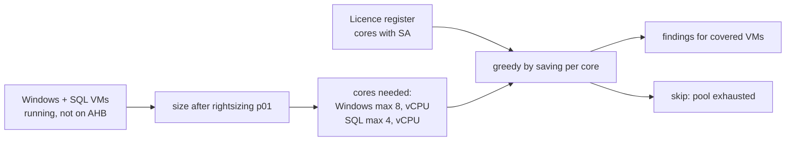

# Pattern 6: Azure Hybrid Benefit

**Module:** [`src/finops/patterns/p06_hybrid_benefit.py`](../../src/finops/patterns/p06_hybrid_benefit.py) ·
**Tests:** [`tests/test_p06_hybrid_benefit.py`](../../tests/test_p06_hybrid_benefit.py) ·
**Run:** `finops pattern p06 --evidence`

A Windows VM's hourly price includes a Windows Server licence, and a SQL Server VM can include a
SQL licence on top. If the company already owns those licences with Software Assurance, Azure
Hybrid Benefit (AHB) lets it apply them and stop paying twice. The catch is that the licence pool
is finite, so the question is not "which VMs qualify" but "which VMs get the cores we have".



## 1. Problem

The licence share of a Windows VM is large: on an E4s_v5 it is $0.184 of the $0.436 hourly price.
Many estates have the licences on paper and never flip the switch, or flip it on VMs that would
have been cheaper to resize first. The assessment needs the licence register, the minimum cores
per VM, and the post-rightsizing size.

## 2. Signals and data sources

| Signal | Azure source | Synthetic stand-in |
|---|---|---|
| VMs on Windows, current `licenseType` | Resource Graph (`properties.licenseType`) | `data/inventory/resources.json` |
| SQL edition and licence type | SQL IaaS Agent extension (`Microsoft.SqlVirtualMachine`) | `sql_edition`, `sql_license` |
| Licence cores with Software Assurance | Licensing team / agreement register | `data/licenses/entitlements.json` |
| Price with and without licence | Retail Prices API Windows vs Linux meters, SQL licence meters | list-price snapshot |
| Target size | Pattern 1 findings | `p01_rightsize.analyze()` |

## 3. Detection logic

The core-count rules that drive most of the money:

<!-- code: src/finops/patterns/p06_hybrid_benefit.py::windows_cores -->
```python
def windows_cores(vcpu: int) -> int:
    return max(8, vcpu)
```
<!-- /code -->

<!-- code: src/finops/patterns/p06_hybrid_benefit.py::sql_cores -->
```python
def sql_cores(vcpu: int) -> int:
    return max(4, vcpu)
```
<!-- /code -->

Licences go to the VMs with the highest saving per core first:

<!-- code: src/finops/patterns/p06_hybrid_benefit.py::assign -->
```python
def assign(candidates: list[dict[str, Any]], pool: int) -> tuple[list[dict[str, Any]], list[dict[str, Any]]]:
    """Greedy by saving per core, ties by name. Returns (covered, not covered)."""
    order = sorted(candidates, key=lambda c: (-c["saving"] / c["cores"], c["name"]))
    covered, left = [], []
    for c in order:
        if c["cores"] <= pool:
            pool -= c["cores"]
            covered.append(c)
        else:
            left.append(c)
    return covered, left
```
<!-- /code -->

## 4. Decision rule

1. Only running Windows VMs that are not already on AHB, and SQL VMs on pay-as-you-go licensing.
2. Assess each VM at its size **after** rightsizing (a D4s_v5 that will become a D2s_v5 is
   assessed as a D2s_v5).
3. Windows Server consumes max(8, vCPU) cores; SQL Server consumes max(4, vCPU) cores of its edition.
4. Assign greedily by monthly saving per core until the pool is used up; the rest are skipped
   with the reason.

## 5. Worked example

<!-- output: pattern p06 --evidence -->
```text
== p06-hybrid-benefit: Azure Hybrid Benefit for owned Windows Server and SQL Server licenses
  vm-dispatch-db-01      AHB SQL Server standard (4 cores)                  $292.00 ->      $0.00  save    $292.00/mo  [high/low]
  vm-dispatch-db-01      AHB Windows Server (8 cores) on E4s_v5             $318.28 ->    $183.96  save    $134.32/mo  [high/low]
  vm-dispatch-legacy-01  AHB Windows Server (8 cores) on D2s_v5             $137.24 ->     $70.08  save     $67.16/mo  [high/low]
  skip vm-jump-01: no Windows Server cores left in the pool (needs 8)
  note: pool: 16 Windows Server cores, 4 SQL Standard cores, 0 SQL Enterprise cores (synthetic register)
  note: savings are the license share of list price; sizes assessed after rightsizing (p01)
  TOTAL: 3 finding(s), $747.52 -> $254.04, save $493.48/mo (66.0%), $5,921.76/yr
  p06-b0c06dc2 vm-dispatch-db-01
    evidence: {"cores_used": 4, "edition": "standard"}
    change:   {"op": "set-sql-license", "sqlLicenseType": "AHUB"}
  p06-4613942c vm-dispatch-db-01
    evidence: {"cores_used": 8, "size_assessed": "E4s_v5"}
    change:   {"licenseType": "Windows_Server", "op": "set-license-type"}
  p06-205a612c vm-dispatch-legacy-01
    evidence: {"cores_used": 8, "size_assessed": "D2s_v5"}
    change:   {"licenseType": "Windows_Server", "op": "set-license-type"}
```
<!-- /output -->

The pool holds 16 Windows Server cores. `vm-dispatch-db-01` and `vm-dispatch-legacy-01` take 8
each, so `vm-jump-01` is skipped: buying 8 more cores is a licensing decision, not a FinOps one.

## 6. Savings math

- `vm-dispatch-db-01` (E4s_v5): Windows rate $0.436/h x 730 = $318.28, base rate $0.252/h x 730 =
  $183.96, saving **$134.32**. Its SQL Server Standard licence meter, $0.40/h for 1 to 4 vCPU, is
  $292.00 a month and drops to zero: **$292.00**.
- `vm-dispatch-legacy-01`, assessed at its post-rightsizing D2s_v5: $137.24 to $70.08, **$67.16**.

Pattern total: **$493.48 a month (66.0% of the licensed cost), $5,921.76 a year**.

## 7. Risks and guardrails

| Risk | Guardrail |
|---|---|
| Using licences you do not have (audit risk) | Assignment never exceeds the register; the register owner approves |
| Double counting with rightsizing | Sizes come from p01 targets |
| Dual-use rights expire after migration | Called out in the plan; tracked by the licensing team |
| Wrong edition | SQL pools are per edition; Standard cores never cover Enterprise |

## 8. Automation and approval flow

The commands are `az vm update --license-type Windows_Server` and
`az sql vm update --license-type AHUB`, both reversible (`--license-type None` / `PAYG`). The
approver must be the licensing owner or FinOps, because the risk is compliance, not uptime.

## 9. IaC and policy

In IaC the switch is one property: `license_type = "Windows_Server"` on
`azurerm_windows_virtual_machine`, `licenseType: 'Windows_Server'` in Bicep. Azure Policy has a
built-in audit for Windows VMs without AHB that can be assigned next to this repo's
`require-tags` policy. The required `cost-center` tag is what lets the licensing team charge the
saving back to the right owner.

## 10. Observability and KQL

<!-- code: queries/arg/hybrid-benefit-candidates.kql -->
```kusto
// Pattern 6: Windows VMs not using Azure Hybrid Benefit, and SQL VMs on pay-as-you-go licensing.
resources
| where type =~ 'microsoft.compute/virtualmachines'
| where properties.storageProfile.osDisk.osType =~ 'Windows'
| extend licenseType = tostring(properties.licenseType), size = tostring(properties.hardwareProfile.vmSize)
| where licenseType !in~ ('Windows_Server', 'Windows_Client')
| project id, name, resourceGroup, subscriptionId, size, licenseType
| union (
    resources
    | where type =~ 'microsoft.sqlvirtualmachine/sqlvirtualmachines'
    | where properties.sqlServerLicenseType !~ 'AHUB'
    | project id, name, resourceGroup, subscriptionId, size = '', licenseType = tostring(properties.sqlServerLicenseType)
)
```
<!-- /code -->

[`queries/kql/hybrid-benefit-coverage.kql`](../../queries/kql/hybrid-benefit-coverage.kql) shows the
licence meters still billing in the cost export: after the change, they should drop to zero.

## 11. Mapping to Azure tools

| Step | Azure tool |
|---|---|
| Find candidates | Resource Graph, Advisor ("use Azure Hybrid Benefit"), Cost Management by meter |
| Apply | VM `licenseType`, SQL IaaS extension licence type, portal AHB blade |
| Govern | Centrally managed AHB for SQL at the billing scope; Azure Policy audit |
| Verify | Cost Management: Windows and SQL licence meters disappear |

## 12. Limitations

- Licensing is simplified to the rules that move most of the money; agreements differ (dedicated
  hosts, Datacenter vs Standard edition, virtualization rights). Verify against your agreement.
- The register is synthetic.
- Linux subscriptions (RHEL, SLES) have their own benefit and are not modeled.

## 13. Interview talking points

- "Hybrid Benefit is a licence allocation problem. The pool is finite, so I give cores to the VMs
  with the highest saving per core."
- "Rightsize first: a VM that shrinks to 2 vCPUs still needs 8 Windows cores, but the saving per
  core changes."
- "SQL on a VM is where the money is: one 4-core SQL Standard licence was $292 a month here."
- "$493 a month on this estate, and the jump box is deliberately left out because the pool ran out."
