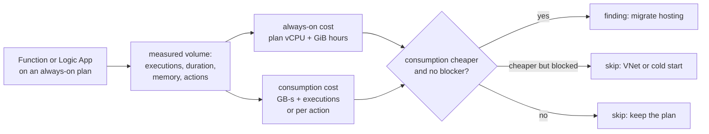

# Pattern 7: Serverless first

**Module:** [`src/finops/patterns/p07_serverless.py`](../../src/finops/patterns/p07_serverless.py) ·
**Tests:** [`tests/test_p07_serverless.py`](../../tests/test_p07_serverless.py) ·
**Run:** `finops pattern p07 --evidence`

Always-on hosting plans bill by the hour whether a workflow runs once a day or a thousand times a
second. Consumption hosting bills per execution. Neither is always cheaper, so this pattern prices
each workload both ways at its measured volume and also proves when **not** to move.



## 1. Problem

Teams pick Functions Premium or Logic Apps Standard for one feature (VNet integration, no cold
start, stateful workflows) and then put every small workload on the same kind of plan. A Logic
Apps Standard WS1 plan is about $0.24 an hour, around $175 a month, before it runs anything. For a
workflow that runs 2,000 times a month, that is the wrong hosting model.

## 2. Signals and data sources

| Signal | Azure source | Synthetic stand-in |
|---|---|---|
| Executions, average duration | Application Insights `requests` for Functions | `monthly_executions`, `avg_duration_s` |
| Memory per execution | Function configuration / instance memory | `memory_gb` |
| Workflow runs and actions per run | `LogicAppWorkflowRuntime` table | `monthly_runs`, `actions_per_run` |
| Hard requirements | VNet integration, cold-start budget from the owner | `needs_vnet`, `max_cold_start_s` |
| Plan and consumption prices | Retail Prices API (Functions Premium vCPU and GiB hours, Flex GB-s and executions with free grant, Logic Apps Standard vCPU and GiB hours, Consumption actions) | list-price snapshot |

## 3. Detection logic

Flex Consumption is priced with the tiered meters, so the monthly free grant in the price list
(first 100,000 GB-seconds and 250,000 executions) is applied by the tier boundaries:

<!-- code: src/finops/patterns/p07_serverless.py::flex_monthly -->
```python
def flex_monthly(executions: int, duration_s: float, memory_gb: float) -> float:
    book = default_book()
    gb_s = executions * duration_s * memory_gb
    return book.tiered_cost("functions.flex.ondemand_gb_second", gb_s) + book.tiered_cost("functions.flex.ondemand_executions_10", executions / 10)
```
<!-- /code -->

<!-- code: src/finops/patterns/p07_serverless.py::logic_consumption_monthly -->
```python
def logic_consumption_monthly(runs: int, actions_per_run: int) -> float:
    return runs * actions_per_run * default_book().price("logicapps.consumption.standard_action")
```
<!-- /code -->

The always-on side is the plan's vCPU and memory hours:

<!-- code: src/finops/costing.py::logic_apps_standard_hourly -->
```python
def logic_apps_standard_hourly(sku: str, book: PriceBook | None = None) -> float:
    book = book or default_book()
    vcpu, gib = WS_SHAPES[sku]
    return vcpu * book.price("logicapps.standard.vcpu_hour") + gib * book.price("logicapps.standard.gib_hour")
```
<!-- /code -->

And the blockers that override price:

<!-- code: src/finops/patterns/p07_serverless.py::blockers -->
```python
def blockers(p: dict[str, Any]) -> list[str]:
    out = []
    if p.get("needs_vnet"):
        out.append("needs VNet integration")
    if p.get("max_cold_start_s", 99) < FLEX_COLD_START_S:
        out.append(f"cold-start budget {p['max_cold_start_s']} s < {FLEX_COLD_START_S} s")
    return out
```
<!-- /code -->

## 4. Decision rule

1. Price the workload on its current plan and on the consumption equivalent at measured volume.
2. If consumption is not cheaper, keep the plan and say by how much.
3. If it is cheaper but the workload needs VNet integration the target cannot give, or has a
   cold-start budget under 3 seconds, skip with the blocker.
4. Otherwise propose the move. Logic Apps Consumption is priced at the standard-connector action
   rate, an upper bound for built-in actions.

## 5. Worked example

<!-- output: pattern p07 --evidence -->
```text
== p07-serverless: Serverless first: consumption instead of always-on plans
  la-invoice-intake  WS1 plan -> Logic Apps Consumption                 $175.16 ->      $3.00  save    $172.16/mo  [high/low]
  fn-label-print     EP1 plan -> Functions Flex Consumption             $145.93 ->      $0.00  save    $145.93/mo  [high/low]
  skip fn-telemetry-ingest: consumption would cost $3,282.30/mo vs $145.93/mo on EP1; keep the plan
  note: Flex price includes the monthly free grant shown in the price list (first 100,000 GB-s and 250,000 executions)
  TOTAL: 2 finding(s), $321.09 -> $3.00, save $318.09/mo (99.1%), $3,817.08/yr
  p07-300c5e49 la-invoice-intake
    evidence: {"actions": 24000, "always_on_monthly": 175.16, "consumption_monthly": 3.0, "runs": 2000}
    change:   {"op": "migrate-hosting", "to": "Logic Apps Consumption"}
  p07-7d7eb05c fn-label-print
    evidence: {"always_on_monthly": 145.93, "consumption_monthly": 0.0, "executions": 120000, "gb_seconds": 24000.0}
    change:   {"op": "migrate-hosting", "to": "Functions Flex Consumption"}
```
<!-- /output -->

## 6. Savings math

- `la-invoice-intake` on WS1: 1 vCPU x $0.192/h + 3.5 GiB x $0.0137/h = $0.2399/h, x 730 h =
  **$175.16** a month. On Consumption: 2,000 runs x 12 actions = 24,000 actions x $0.000125 =
  **$3.00**. Saving **$172.16**.
- `fn-label-print` on EP1: **$145.93** a month. On Flex: 120,000 executions x 0.4 s x 0.5 GB =
  24,000 GB-s, inside the 100,000 GB-s and 250,000 execution free grant, so **$0.00**.
  Saving **$145.93**.
- `fn-telemetry-ingest` is the counter-example: 900 million executions x 0.25 s x 0.5 GB =
  112.5 million GB-s. On Flex that is **$3,282.30** a month against $145.93 on EP1. It stays.

Pattern total: **$318.09 a month (99.1%), $3,817.08 a year**.

## 7. Risks and guardrails

| Risk | Guardrail |
|---|---|
| Cold start hurts a user-facing call | Cold-start budget under 3 s blocks the move |
| Private networking lost | `needs_vnet` blocks it (or choose Flex with VNet integration and price it) |
| High volume flips the economics | Price both sides at measured volume; the telemetry function proves the rule |
| Stateful Logic Apps features | Owner confirms the workflows only use features Consumption supports |
| Free grant is per subscription | Applied once per workload here; on a shared subscription it is shared |

## 8. Automation and approval flow

Changing hosting model is a redeploy, so the agent emits "change via infrastructure-as-code pull
request: WS1 plan -> Logic Apps Consumption". The old plan is deleted only after the new one has
run in parallel; that deletion goes through pattern 8 and its approval.

## 9. IaC and policy

The guardrail is a budget plus an allowed-SKU style policy for plans. This repo's budget and action
group ([`infra/terraform/main.tf`](../../infra/terraform/main.tf)) are what caught the idle WS1 plan
in the [case study](../case-study.md): it was the largest line on a practice subscription's
forecast. A policy that audits `Microsoft.Web/serverfarms` with `WS*` or `EP*` SKUs outside
approved resource groups is a natural extension.

## 10. Observability and KQL

<!-- code: queries/kql/logic-apps-standard-runs.kql -->
```kusto
// Patterns 7 and 8: workflow runs per Logic App (Standard). Zero runs on an always-on WS plan = idle cost.
LogicAppWorkflowRuntime
| where TimeGenerated > ago(30d)
| where OperationName has 'WorkflowRunCompleted'
| summarize runs = count(), last_run = max(TimeGenerated) by _ResourceId, WorkflowName
| join kind=rightouter (LogicAppWorkflowRuntime | distinct _ResourceId) on _ResourceId
| extend runs = coalesce(runs, 0)
```
<!-- /code -->

[`queries/kql/serverless-volume.kql`](../../queries/kql/serverless-volume.kql) collects executions
and duration per Function App, the two inputs for the Flex estimate.

## 11. Mapping to Azure tools

| Step | Azure tool |
|---|---|
| Find always-on plans | Resource Graph (`microsoft.web/serverfarms` by SKU) |
| Volume | Application Insights, Log Analytics `LogicAppWorkflowRuntime` |
| Price both | Retail Prices API, pricing calculator |
| Verify | Cost Management by resource after the move |

## 12. Limitations

- Always-ready instances on Flex (to remove cold start) are not priced.
- Logic Apps Consumption uses one action price; enterprise connectors cost more.
- Duration is an average; heavy-tailed durations raise GB-s.

## 13. Interview talking points

- "Serverless first is a volume question. I price both sides at measured volume."
- "The idle WS1 plan is a real pattern: $0.24 an hour is $175 a month for a workflow that runs
  2,000 times. On Consumption it is $3."
- "And I show the opposite case: at 900 million executions, Flex would be $3,282 a month against
  $146 on Premium. That one stays."
