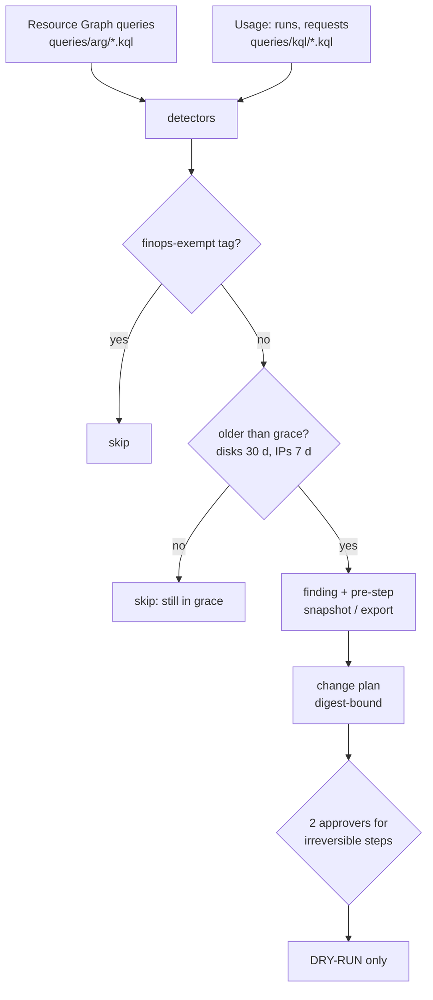
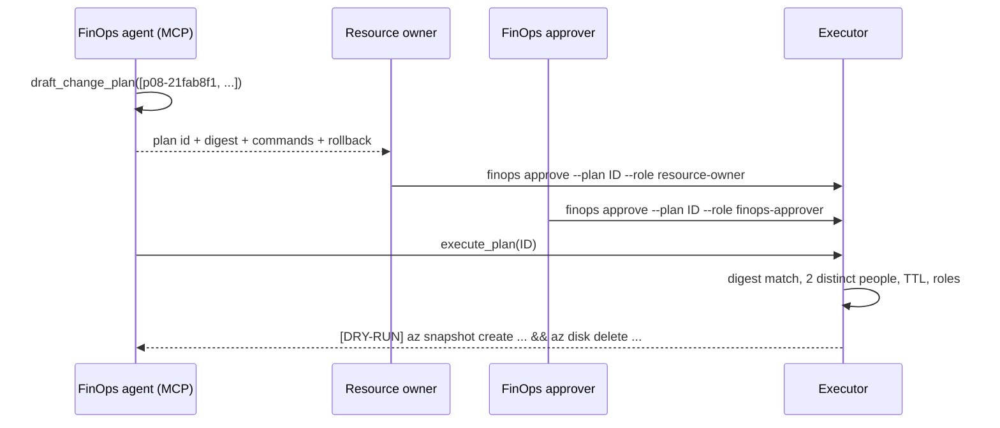

# Pattern 8: Idle and orphaned resource cleanup

**Module:** [`src/finops/patterns/p08_idle_cleanup.py`](../../src/finops/patterns/p08_idle_cleanup.py) ·
**Tests:** [`tests/test_p08_idle_cleanup.py`](../../tests/test_p08_idle_cleanup.py) ·
**Run:** `finops pattern p08 --evidence`, then `finops agent --top 5`

Every estate collects leftovers: the data disk from a migration, the public IP of a deleted
gateway, the empty App Service plan from a proof of concept, the VM someone shut down from inside
Windows so it still bills. Each one is small; together they are steady money for nothing. Cleanup
is also the riskiest FinOps action, because deletion is permanent. So this pattern finds them, and
a human decides.



## 1. Problem

Orphans happen because creating a resource is one command and cleaning up its dependencies is
several. Deleting a VM leaves its disks, NICs and public IPs unless someone asked otherwise.
Stopping a VM from the guest OS leaves it allocated, so compute keeps billing. And plans on
"always-on" SKUs bill with zero apps or zero runs. The hard part is not finding them: it is being
sure enough to delete, and doing it in a way an auditor would accept.

## 2. Signals and data sources

| Signal | Azure source | Synthetic stand-in |
|---|---|---|
| Disk state and time unattached | Resource Graph `properties.diskState`, `LastOwnershipUpdateTime` | `disk_state`, `days_unattached` |
| Public IP association | Resource Graph `properties.ipConfiguration` | `associated`, `days_unassociated` |
| NIC attachment | Resource Graph `properties.virtualMachine`, `privateEndpoint` | `attached` |
| VM power state | Resource Graph `properties.extended.instanceView.powerState` | `power_state` |
| Plans with no apps or no runs | Resource Graph + `LogicAppWorkflowRuntime` | `apps`, `workflow_runs_30d` |
| Opt-out | `finops-exempt=true` tag | `tags` |

## 3. Detection logic

One function, one branch per orphan type, each mirroring a Resource Graph query:

<!-- code: src/finops/patterns/p08_idle_cleanup.py::detect -->
```python
def detect(
    inventory: list[dict[str, Any]], book: PriceBook | None = None, pattern: str = PATTERN
) -> PatternResult:
    book = book or default_book()
    res = PatternResult(pattern, "Idle and orphaned resource cleanup (approval required)", [])
    plans_with_running_apps = {
        r["properties"].get("plan") for r in inventory if r["properties"].get("monthly_runs", 0) > 0
    }
    for r in inventory:
        t, p, name = r["type"], r["properties"], r["name"]
        if r["tags"].get("finops-exempt") == "true":
            res.skipped.append((name, "tagged finops-exempt=true"))
            continue
        f = None
        if t.endswith("disks") and p.get("disk_state") == "Unattached":
            if p["days_unattached"] < GRACE_DAYS["disk"]:
                res.skipped.append(
                    (name, f"unattached {p['days_unattached']} d (< {GRACE_DAYS['disk']} d grace)")
                )
                continue
            f = Finding(
                pattern,
                r["id"],
                name,
                f"snapshot + delete unattached {r['sku']} disk ({p['days_unattached']} d)",
                monthly_cost(r, book),
                0.0,
                change={"op": "delete", "pre": "snapshot"},
                reversible=False,
                evidence={"days_unattached": p["days_unattached"], "size_gb": p["size_gb"]},
            )
        elif t.endswith("publicIPAddresses") and not p.get("associated", True):
            if p["days_unassociated"] < GRACE_DAYS["pip"]:
                res.skipped.append(
                    (name, f"unassociated {p['days_unassociated']} d (< {GRACE_DAYS['pip']} d grace)")
                )
                continue
            f = Finding(
                pattern,
                r["id"],
                name,
                f"delete unassociated public IP ({p['days_unassociated']} d)",
                monthly_cost(r, book),
                0.0,
                change={"op": "delete"},
                reversible=False,
                evidence={"days_unassociated": p["days_unassociated"]},
            )
        elif t.endswith("networkInterfaces") and not p.get("attached", True):
            f = Finding(
                pattern,
                r["id"],
                name,
                "delete orphaned NIC (hygiene, $0)",
                0.0,
                0.0,
                change={"op": "delete"},
                reversible=False,
            )
        elif t.endswith("serverfarms") and (
            p.get("apps") == 0 or (p.get("kind") == "workflowapp-plan" and p.get("workflow_runs_30d") == 0)
        ):
            idle_reason = (
                "0 apps"
                if p.get("apps") == 0
                else f"0 workflow runs in 30 d (last run {p.get('last_run_days_ago')} d ago)"
            )
            f = Finding(
                pattern,
                r["id"],
                name,
                f"delete idle {r['sku']} plan ({idle_reason})",
                monthly_cost(r, book),
                0.0,
                change={"op": "delete", "pre": "export-config"},
                reversible=False,
                evidence={"reason": idle_reason},
            )
            if r["id"] in plans_with_running_apps:
                f = None
        elif t.endswith("virtualMachines") and p.get("power_state") == "stopped":
            f = Finding(
                pattern,
                r["id"],
                name,
                "deallocate VM stopped but still billing compute",
                monthly_cost(r, book),
                0.0,
                change={"op": "deallocate"},
                evidence={"power_state": "stopped (not deallocated)"},
            )
        elif t.endswith("virtualMachines") and p.get("power_state") == "deallocated":
            res.skipped.append((name, "deallocated: compute is already $0; owner review for disks"))
            continue
        elif (
            t.endswith("containerApps")
            and p["min_replicas"] > 0
            and p["active_fraction"] == 0
            and p["monthly_requests"] == 0
        ):
            after = container_app_monthly(0, p["vcpu"], p["gib"], 0, 0, book)
            f = Finding(
                pattern,
                r["id"],
                name,
                f"minReplicas {p['min_replicas']} -> 0 (zero requests in 30 d)",
                monthly_cost(r, book),
                after,
                change={"op": "set-scale", "minReplicas": 0},
                evidence={"requests_30d": 0, "min_replicas": p["min_replicas"]},
            )
        if f:
            res.findings.append(f)
    return res
```
<!-- /code -->

The same `detect` runs on the anonymized [case study](../case-study.md) inventory.

## 4. Decision rule

| Type | Condition | Action | Reversible |
|---|---|---|---|
| Managed disk | Unattached 30+ days | Snapshot, then delete | No (snapshot is the recovery) |
| Public IP | Unassociated 7+ days | Delete | No (the address is lost) |
| NIC | Attached to nothing | Delete ($0, hygiene) | No |
| App Service / Logic Apps plan | 0 apps, or 0 workflow runs in 30 days | Export config, delete | No |
| VM | Stopped, not deallocated | Deallocate | Yes |
| VM | Deallocated | Owner review (disks still bill) | n/a |
| Container App | Warm replica, 0 requests in 30 days | `minReplicas` 0 | Yes |

Anything tagged `finops-exempt=true` is never proposed.

## 5. Worked example

<!-- output: pattern p08 -->
```text
== p08-idle-cleanup: Idle and orphaned resource cleanup (approval required)
  vm-poc-gpu-replacement  deallocate VM stopped but still billing compute     $140.16 ->      $0.00  save    $140.16/mo  [high/low]
  disk-migr-data-01       snapshot + delete unattached P30 disk (64 d)       $122.88 ->      $0.00  save    $122.88/mo  [high/low]
  asp-poc-empty           delete idle P1v3 plan (0 apps)                     $113.15 ->      $0.00  save    $113.15/mo  [high/low]
  disk-migr-data-02       snapshot + delete unattached P10 disk (64 d)        $17.92 ->      $0.00  save     $17.92/mo  [high/low]
  pip-migr-gw-01          delete unassociated public IP (41 d)                 $3.65 ->      $0.00  save      $3.65/mo  [high/low]
  nic-migr-vm-01          delete orphaned NIC (hygiene, $0)                    $0.00 ->      $0.00  save      $0.00/mo  [high/low]
  skip disk-dev-scratch-01: unattached 2 d (< 30 d grace)
  skip pip-migr-gw-02: tagged finops-exempt=true
  skip pip-dev-lb-01: unassociated 1 d (< 7 d grace)
  skip vm-poc-old-ui: deallocated: compute is already $0; owner review for disks
  note: grace periods: disks 30 d, public IPs 7 d; every action needs an approved plan
  TOTAL: 6 finding(s), $397.76 -> $0.00, save $397.76/mo (100.0%), $4,773.12/yr
```
<!-- /output -->

The agent turns the top findings across all patterns into one plan:

<!-- output: agent --top 5 -->
```text
== estate: Larkspur Freight (fictional), list-price snapshot
  billed (30-day FOCUS export, projected to 730 h): $12,696.61/mo
  p01-rightsize            save    $713.94/mo
  p02-autoscale            save    $811.80/mo
  p03-commitments          save    $348.79/mo
  p04-spot                 save    $301.06/mo
  p05-storage-tiering      save  $1,844.01/mo
  p06-hybrid-benefit       save    $493.48/mo
  p07-serverless           save    $318.09/mo
  p08-idle-cleanup         save    $397.76/mo
  p10-cache-egress         save    $930.38/mo
  TOTAL proposed savings $6,159.31/mo (48.5% of the bill), $73,911.72/yr
  findings: 29; conflicts resolved: 0; reconciliation checks: 12/12 within 5% of the bill
  top 5:
    p05-57493bab  stlkdatalake/raw-telemetry lifecycle 0d+:hot / 30d+:cool / 90d+:cold / 180d+:archive save $1,483.60/mo [medium]
    p10-72fd9262  nightly-lake-copy          incremental copy (12% changed) instead of full       save   $739.20/mo [low]
    p02-062bff75  aks-dispatch-prod          cluster autoscaler 6 fixed -> 2..8 (avg 3.26)        save   $384.61/mo [low]
    p05-90f3919e  stlkdatalake/shipment-docs lifecycle 0d+:hot / 30d+:cool / 90d+:cold / 180d+:cold save   $360.41/mo [low]
    p02-871c3129  asp-portal-prod            autoscale 6 fixed -> 2..10 (avg 2.88)                save   $352.92/mo [low]
  plan plan-3bc1fb296c (digest 1151a64d424b...), 5 steps, status awaiting-approval:
    [DRY-RUN when approved] az storage account management-policy create --account-name stlkdatalake -g <rg> --policy @lifecycle-policy.json
    [DRY-RUN when approved] # change via infrastructure-as-code pull request: incremental copy (12% changed) instead of full
    [DRY-RUN when approved] az aks nodepool update -g rg-dispatch-prod --cluster-name aks-dispatch-prod -n nodepool1 --enable-cluster-autoscaler --min-count 2 --max-count 8
    [DRY-RUN when approved] az storage account management-policy create --account-name stlkdatalake -g <rg> --policy @lifecycle-policy.json
    [DRY-RUN when approved] az monitor autoscale create -g rg-portal-prod --resource asp-portal-prod --resource-type Microsoft.Web/serverfarms --min-count 2 --max-count 10 --count 2
```
<!-- /output -->

## 6. Savings math

| Resource | Price basis (list-price snapshot) | Monthly |
|---|---|---|
| `vm-poc-gpu-replacement` (D4s_v5, stopped) | $0.192/h x 730 | $140.16 |
| `disk-migr-data-01` (P30, 1 TiB) | $122.88 per month | $122.88 |
| `asp-poc-empty` (P1v3, 0 apps) | $0.155/h x 730 | $113.15 |
| `disk-migr-data-02` (P10) | $17.92 per month | $17.92 |
| `pip-migr-gw-01` (Standard static IP) | $0.005/h x 730 | $3.65 |

Pattern total: **$397.76 a month, $4,773.12 a year**. The snapshot taken before a disk delete has
its own (smaller) storage cost, which is not netted off here.

## 7. Risks and guardrails

| Risk | Guardrail |
|---|---|
| Deleting something in use | Grace periods; usage signals for plans; exempt tag |
| No way back | Snapshot or config export first; irreversible plans need **two distinct approvers** |
| Approval for one plan used for another | Approval is bound to the plan's SHA-256 digest; any edit invalidates it |
| Stale approval | Approvals expire after 72 hours |
| Agent approves itself | The requester cannot approve; there is no approve tool on the MCP server |
| Silent change | Hash-chained audit log; execution is dry-run only |

## 8. Automation and approval flow



Approvals happen outside the agent, through the CLI (or a ticket in a real setup). The
[FinOps agent doc](../finops-agent.md) has the full walk-through.

## 9. IaC and policy

- `deny-untagged-public-ip` ([`infra/policies/deny-untagged-public-ip.json`](../../infra/policies/deny-untagged-public-ip.json))
  stops new public IPs without an `owner` and `cost-center`, so the next orphan has someone to ask.
- `require-tags` makes the same true for every resource.
- The deny effect is used in prod; dev uses audit so experiments are not blocked.

<!-- code: infra/policies/deny-untagged-public-ip.json -->
```json
{
  "displayName": "FinOps: deny public IPs without an owner and cost center",
  "description": "Public IPs are the most common orphan. Every new one must say who pays for it and who owns it.",
  "mode": "Indexed",
  "metadata": { "category": "Network" },
  "parameters": {
    "effect": {
      "type": "String",
      "allowedValues": ["Audit", "Deny", "Disabled"],
      "defaultValue": "Deny"
    }
  },
  "policyRule": {
    "if": {
      "allOf": [
        { "field": "type", "equals": "Microsoft.Network/publicIPAddresses" },
        {
          "anyOf": [
            { "field": "tags['cost-center']", "exists": "false" },
            { "field": "tags['owner']", "exists": "false" }
          ]
        }
      ]
    },
    "then": { "effect": "[parameters('effect')]" }
  }
}
```
<!-- /code -->

## 10. Observability and KQL

Six Resource Graph queries back the detectors, for example:

<!-- code: queries/arg/unattached-disks.kql -->
```kusto
// Pattern 8: managed disks attached to nothing, oldest first. Azure Resource Graph (read-only).
resources
| where type =~ 'microsoft.compute/disks'
| where properties.diskState =~ 'Unattached'
| extend sku = tostring(sku.name), sizeGb = toint(properties.diskSizeGB)
| extend unattachedSince = todatetime(properties.LastOwnershipUpdateTime)
| extend daysUnattached = datetime_diff('day', now(), unattachedSince)
| where tostring(tags['finops-exempt']) != 'true'
| project id, name, resourceGroup, subscriptionId, sku, sizeGb, daysUnattached, owner = tostring(tags.owner)
| order by daysUnattached desc
```
<!-- /code -->

Others: [`unassociated-public-ips.kql`](../../queries/arg/unassociated-public-ips.kql),
[`orphaned-nics.kql`](../../queries/arg/orphaned-nics.kql),
[`stopped-not-deallocated-vms.kql`](../../queries/arg/stopped-not-deallocated-vms.kql),
[`idle-app-service-plans.kql`](../../queries/arg/idle-app-service-plans.kql),
[`container-apps-warm-replicas.kql`](../../queries/arg/container-apps-warm-replicas.kql). Usage comes
from [`logic-apps-standard-runs.kql`](../../queries/kql/logic-apps-standard-runs.kql) and
[`container-apps-requests.kql`](../../queries/kql/container-apps-requests.kql).

## 11. Mapping to Azure tools

| Step | Azure tool |
|---|---|
| Find | Resource Graph, Advisor ("delete unattached disks", "shut down idle VMs"), Azure Orphaned Resources workbook |
| Decide | Cost Management cost by resource, owner tags |
| Act | Azure Automation runbook or a pipeline, run only after approval |
| Prevent | Azure Policy (tags, deny public IP without tags), delete-with-VM options on disks and NICs |

## 12. Limitations

- Snapshots, old images, empty resource groups, unused NAT gateways and load balancers without
  backends are not detected yet.
- "Days unattached" relies on ownership timestamps that some older disks do not have.
- The executor is dry-run only by design; a real runbook would need its own identity with
  narrowly scoped rights.

## 13. Interview talking points

- "Finding orphans is easy; deleting them safely is the job. Grace periods, an exempt tag,
  snapshots first, and two people for anything irreversible."
- "Approvals are bound to a digest of the plan, expire in 72 hours, and the agent cannot approve
  its own plan. The MCP server has no approve tool at all."
- "A VM stopped from inside the OS still bills. Deallocate is the cheapest win in the list."
- "$397.76 a month here, $4,773 a year, for resources nobody was using."
