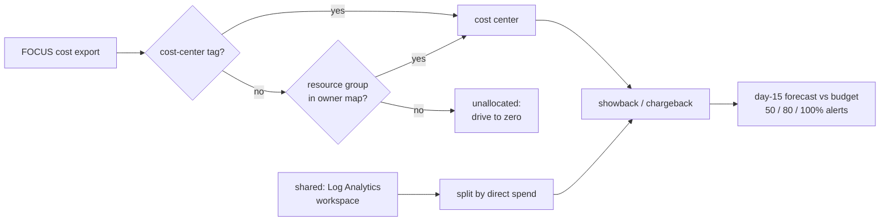

# Pattern 9: Tagging, budgets and chargeback

**Module:** [`src/finops/patterns/p09_tagging_chargeback.py`](../../src/finops/patterns/p09_tagging_chargeback.py) ·
**Tests:** [`tests/test_p09_tagging.py`](../../tests/test_p09_tagging.py) ·
**Run:** `finops pattern p09`

Nothing in patterns 1 to 8 sticks unless someone owns the cost. This pattern does not change a
single price. It makes every dollar land on a cost center, splits shared platform cost fairly,
and warns a team mid-month when its forecast passes its budget. Accountability is the lever.



## 1. Problem

Untagged spend is nobody's spend. When the monthly bill arrives as one number, no team feels it,
and optimization becomes a central team chasing others. Showback (here is what you used) and
chargeback (and here is the internal invoice) need three things: reliable tags, a rule for the
untagged remainder, and a fair split of shared services like logging.

## 2. Signals and data sources

| Signal | Azure source | Synthetic stand-in |
|---|---|---|
| Cost per resource per day, with tags | Cost Management FOCUS export (`EffectiveCost`, `Tags`) | `data/focus/cost-export.csv` |
| Required tags, owner map, shared resources, budgets | FinOps team's allocation rules | `data/allocation/rules.json` |
| Missing tags in the live estate | Resource Graph | `queries/arg/untagged-resources.kql` |

Required tags: `cost-center`, `owner`, `env`, `app`. Five cost centers, from Dispatch and
Integration (CC-1001) to AI Assistants (CC-5005).

## 3. Detection logic

Compliance is measured in dollars, not resource counts, because a missing tag on a $0 NIC matters
less than one on a disk:

<!-- code: src/finops/patterns/p09_tagging_chargeback.py::compliance -->
```python
def compliance(rows: list[CostRow], required: list[str]) -> dict[str, Any]:
    total = sum(r.cost for r in rows)
    ok = sum(r.cost for r in rows if all(k in r.tags for k in required))
    missing = sorted({r.resource_name for r in rows if not all(k in r.tags for k in required)})
    return {"tagged_cost_pct": round(100 * ok / total, 1), "untagged_resources": missing, "untagged_cost": round(total - ok, 2)}
```
<!-- /code -->

<!-- code: src/finops/patterns/p09_tagging_chargeback.py::owner_of -->
```python
def owner_of(row: CostRow, rules: dict[str, Any]) -> tuple[str, str]:
    if cc := row.tags.get("cost-center"):
        return cc, "tag"
    rg = row.resource_id.split("/resourceGroups/")[1].split("/")[0]
    if cc := rules["resource_group_owner"].get(rg):
        return cc, "resource-group map"
    return "unallocated", "none"
```
<!-- /code -->

<!-- code: src/finops/patterns/p09_tagging_chargeback.py::showback -->
```python
def showback(rows: list[CostRow], rules: dict[str, Any]) -> dict[str, dict[str, float]]:
    shared_ids = {k.split("/")[1] for k in rules["shared"]}
    direct: dict[str, float] = defaultdict(float)
    shared_pool = 0.0
    for r in rows:
        if r.resource_name in shared_ids:
            shared_pool += r.cost
            continue
        direct[owner_of(r, rules)[0]] += r.cost
    base = sum(v for k, v in direct.items() if k != "unallocated")
    out = {}
    for cc in sorted(direct):
        share = 0.0 if cc == "unallocated" else shared_pool * direct[cc] / base
        out[cc] = {"direct": round(direct[cc], 2), "shared": round(share, 2), "total": round(direct[cc] + share, 2)}
    return out
```
<!-- /code -->

Budgets are checked against **allocated** cost, the amount a cost center would be charged, with a
straight-line forecast from the first 15 days:

<!-- code: src/finops/patterns/p09_tagging_chargeback.py::budget_status -->
```python
def budget_status(rows: list[CostRow], rules: dict[str, Any], day: int = FORECAST_DAY) -> list[dict[str, Any]]:
    """Budgets are checked against ALLOCATED cost (direct + shared share), the number a cost
    center is charged, using a straight-line forecast from the first ``day`` days."""
    days = sorted({r.day for r in rows})
    mtd_days = set(days[:day])
    alloc = showback([r for r in rows if r.day in mtd_days], rules)
    out = []
    for cc, budget in sorted(rules["budgets"].items()):
        mtd = {k: v["total"] for k, v in alloc.items()}.get(cc, 0.0)
        forecast = mtd / day * len(days)
        hit = [t for t in rules["alert_thresholds"] if forecast >= budget * t]
        out.append({"cost_center": cc, "budget": budget, "mtd": round(mtd, 2), "forecast": round(forecast, 2),
                    "forecast_pct": round(100 * forecast / budget, 1), "alerts": [f"{int(t * 100)}%" for t in hit]})
    return out
```
<!-- /code -->

## 4. Decision rule

1. Allocate by `cost-center` tag; otherwise by the resource-group owner map; otherwise
   "unallocated".
2. Every resource allocated through the map becomes a finding: add the tag at the source.
3. Shared cost is split in proportion to each cost center's direct spend.
4. Alert at 50%, 80% and 100% of budget on the day-15 forecast.

## 5. Worked example

<!-- output: pattern p09 -->
```text
== p09-tagging-chargeback: Tagging, showback/chargeback and budgets
  disk-migr-data-01  add cost-center tag (owner from resource-group map)     $121.20 ->    $121.20  save      $0.00/mo  [high/low]
  disk-migr-data-02  add cost-center tag (owner from resource-group map)      $17.67 ->     $17.67  save      $0.00/mo  [high/low]
  nic-migr-vm-01     add cost-center tag (owner from resource-group map)       $0.00 ->      $0.00  save      $0.00/mo  [high/low]
  pip-migr-gw-01     add cost-center tag (owner from resource-group map)       $3.60 ->      $3.60  save      $0.00/mo  [high/low]
  pip-migr-gw-02     add cost-center tag (owner from resource-group map)       $3.60 ->      $3.60  save      $0.00/mo  [high/low]
  note: tag compliance: 98.8% of cost has all required tags; untagged cost $146.07
  note: showback CC-1001      direct  $2,823.77  shared   $236.13  total  $3,059.91
  note: showback CC-2002      direct  $3,383.34  shared   $282.93  total  $3,666.27
  note: showback CC-3003      direct  $4,329.80  shared   $362.07  total  $4,691.88
  note: showback CC-4004      direct    $419.67  shared    $35.09  total    $454.77
  note: showback CC-5005      direct    $599.72  shared    $50.15  total    $649.87
  note: budget CC-1001: day-15 forecast $3,060.04 = 90.0% of $3,400.00 -> alerts ['50%', '80%']
  note: budget CC-2002: day-15 forecast $3,666.42 = 96.5% of $3,800.00 -> alerts ['50%', '80%']
  note: budget CC-3003: day-15 forecast $4,687.08 = 104.2% of $4,500.00 -> alerts ['50%', '80%', '100%']
  note: budget CC-4004: day-15 forecast $454.78 = 75.8% of $600.00 -> alerts ['50%']
  note: budget CC-5005: day-15 forecast $647.92 = 92.6% of $700.00 -> alerts ['50%', '80%']
  TOTAL: 5 finding(s), $146.07 -> $146.07, save $0.00/mo (0.0%), $0.00/yr
```
<!-- /output -->

CC-3003 (Data and Analytics) is forecast at 104.2% of its $4,500 budget by day 15, so all three
alerts fire with half the month left to act. Note the showback totals: each includes its share of
the platform Log Analytics workspace.

## 6. Savings math

There is no price saving, and the report says $0.00 on purpose. The measurable result is
**98.8%** of cost carrying all required tags, with $146.07 a month of untagged cost (five sandbox
resources) mapped to an owner and nothing left unallocated. The money follows indirectly: the
idle disks among those five are exactly what pattern 8 proposes to delete, and now there is a
named owner to approve it.

## 7. Risks and guardrails

| Risk | Guardrail |
|---|---|
| Tags drift after deployment | `require-tags` policy (Audit in dev, Deny in prod) |
| Allocation rule hides missing tags | Map-allocated resources are reported as findings until tagged |
| Unfair shared split | Proportional to direct spend, documented in the rules file |
| Alert fatigue | Three thresholds only, on a forecast, sent to one action group |
| Chargeback disputes | Every number traces to FOCUS rows; the export reconciles to the bill |

## 8. Automation and approval flow

The plan step is `az tag update --resource-id <id> --operation merge --tags cost-center=<from rg map>`.
Merge, not replace, so existing tags survive. Tag changes are reversible and need one approver,
normally the resource-group owner named in the map.

## 9. IaC and policy

The `require-tags` definition is shared by Terraform and Bicep:

<!-- code: infra/policies/require-tags.json -->
```json
{
  "displayName": "FinOps: require cost allocation tags",
  "description": "Deny new resources that do not carry every required tag (cost-center, owner, env, app).",
  "mode": "Indexed",
  "metadata": { "category": "Tags" },
  "parameters": {
    "tagNames": {
      "type": "Array",
      "metadata": { "displayName": "Required tag names" },
      "defaultValue": ["cost-center", "owner", "env", "app"]
    },
    "effect": {
      "type": "String",
      "allowedValues": ["Audit", "Deny", "Disabled"],
      "defaultValue": "Deny"
    }
  },
  "policyRule": {
    "if": {
      "count": {
        "value": "[parameters('tagNames')]",
        "name": "tagName",
        "where": { "field": "[concat('tags[', current('tagName'), ']')]", "exists": "false" }
      },
      "greater": 0
    },
    "then": { "effect": "[parameters('effect')]" }
  }
}
```
<!-- /code -->

The budget, with actual and forecast notifications to the action group:

<!-- code: infra/terraform/main.tf::resource "azurerm_consumption_budget_resource_group" -->
```hcl
resource "azurerm_consumption_budget_resource_group" "this" {
  name              = "budget-${local.short}-${local.suffix}"
  resource_group_id = azurerm_resource_group.this.id
  amount            = var.monthly_budget
  time_grain        = "Monthly"

  time_period {
    start_date = formatdate("YYYY-MM-01'T'00:00:00Z", timestamp())
  }

  dynamic "notification" {
    for_each = local.budget_notifications
    content {
      enabled        = true
      threshold      = tonumber(notification.key)
      threshold_type = notification.value
      operator       = "GreaterThanOrEqualTo"
      contact_groups = [azurerm_monitor_action_group.finops.id]
    }
  }

  lifecycle {
    ignore_changes = [time_period] # the start month is fixed at creation
  }
}
```
<!-- /code -->

## 10. Observability and KQL

<!-- code: queries/arg/untagged-resources.kql -->
```kusto
// Pattern 9: resources missing any required tag.
resources
| extend t = tags
| where isnull(t['cost-center']) or isnull(t['owner']) or isnull(t['env']) or isnull(t['app'])
| project id, name, type, resourceGroup, subscriptionId,
          missing = strcat_array(set_difference(dynamic(['cost-center','owner','env','app']), bag_keys(t)), ',')
| order by type asc
```
<!-- /code -->

[`queries/kql/cost-anomaly.kql`](../../queries/kql/cost-anomaly.kql) runs on the same export,
ingested as a custom table, and flags daily spikes per resource; schedule it as a log alert to
the same action group.

## 11. Mapping to Azure tools

| Step | Azure tool |
|---|---|
| Tag enforcement | Azure Policy (require, inherit from resource group, modify) |
| Allocation | Cost Management cost allocation rules, tag inheritance |
| Showback | Cost analysis grouped by tag, exported FOCUS data in Fabric or Power BI |
| Budgets and alerts | Cost Management budgets, action groups, anomaly alerts |
| Live gaps | Resource Graph |

## 12. Limitations

- One shared resource and one split rule; real platforms split networking, security and support
  differently.
- The forecast is a straight line; month-end batch work makes it low.
- Synthetic export covers one billing period.

## 13. Interview talking points

- "I measure tag compliance in dollars, not resources. 98.8% of cost here is fully tagged."
- "Untagged cost gets an owner through a resource-group map, and every mapped resource is a
  finding until it is tagged at the source."
- "Budgets fire on a mid-month forecast against allocated cost. Data and Analytics was at 104%
  on day 15, with time left to act."
- "This pattern saves $0 directly. It is the one that makes the other nine stick."
