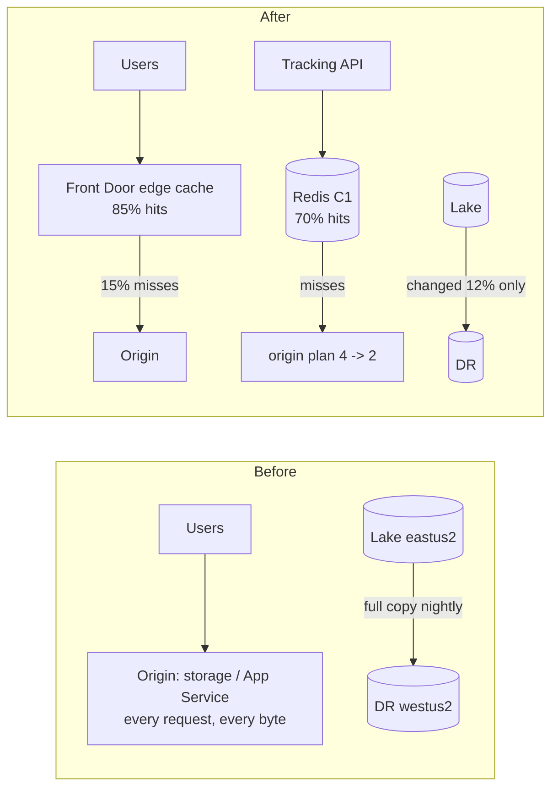

# Pattern 10: Cache and egress optimization

**Module:** [`src/finops/patterns/p10_cache_egress.py`](../../src/finops/patterns/p10_cache_egress.py) ·
**Tests:** [`tests/test_p10_cache_egress.py`](../../tests/test_p10_cache_egress.py) ·
**Run:** `finops pattern p10 --evidence`

Data that moves costs money: out to the internet, between regions, and in compute spent serving
the same answer again. This pattern prices three levers from the list-price snapshot: an edge
cache for static content, a Redis cache in front of a read-heavy API, and incremental instead of
full cross-region copies. It is also honest when a lever mostly buys latency, not savings.



## 1. Problem

Egress is the cost line people forget at design time. A static portal serving 18,000 GB a month
straight from its origin pays internet egress on every byte and scales the origin for every
request. An API that recomputes the same tracking answer thousands of times runs four plan
instances where two would do. And a disaster-recovery job that copies a whole 42,000 GB lake every
night pays inter-region transfer on data that did not change.

## 2. Signals and data sources

| Signal | Azure source | Synthetic stand-in |
|---|---|---|
| Egress GB and requests per endpoint | Storage / App Service `BytesSent` metrics, Front Door logs | `data/network/endpoints.json` |
| Cacheable share, expected hit ratio | Front Door cache-hit metric, Redis `INFO stats` | `cacheable`, `expected_hit_ratio` (**assumptions**) |
| Cross-region copy volume and changed fraction | Copy job logs, Data Factory run output | `cross_region` |
| Prices: internet egress tiers, inter-region, Front Door base, egress, requests, Redis | Retail Prices API | list-price snapshot |

## 3. Detection logic

Front Door is priced as base fee plus tiered edge egress plus requests:

<!-- code: src/finops/patterns/p10_cache_egress.py::front_door_monthly -->
```python
def front_door_monthly(egress_gb: float, requests_10k: float) -> float:
    book = default_book()
    return (
        book.price("frontdoor.standard.base_month")
        + book.tiered_cost("frontdoor.standard.egress_gb", egress_gb)
        + book.tiered_cost("frontdoor.standard.requests_10k", requests_10k)
    )
```
<!-- /code -->

The full analysis covers all three levers, and skips Front Door when it would not beat origin
egress:

<!-- code: src/finops/patterns/p10_cache_egress.py::analyze -->
```python
def analyze() -> PatternResult:
    book = default_book()
    reg = load_json("network/endpoints.json")
    inv = {r["name"]: r for r in load_inventory()}
    res = PatternResult(PATTERN, "Cache and egress optimization", [])
    for ep in reg["endpoints"]:
        origin_egress = book.tiered_cost("bandwidth.internet_egress_gb", ep["egress_gb"])
        if ep.get("cache") == "redis":
            plan = inv[ep["origin_plan"]]
            n = plan["properties"]["instances"]
            unit = book.monthly(f"appservice.{plan['sku']}")
            new_n = max(2, math.ceil(n * (1 - ep["expected_hit_ratio"])))
            before = unit * n
            after = unit * new_n + book.monthly(REDIS_SKU)
            res.findings.append(
                Finding(
                    PATTERN,
                    plan["id"],
                    ep["name"],
                    f"Redis C1 cache-aside: {n} -> {new_n} {plan['sku']} instances",
                    before,
                    after,
                    confidence="medium",
                    risk="low",
                    change={"op": "add-cache", "sku": "Standard C1", "origin_instances": new_n},
                    evidence={
                        "hit_ratio": ep["expected_hit_ratio"],
                        "redis_monthly": round(book.monthly(REDIS_SKU), 2),
                    },
                    estimate=True,
                )
            )
            continue
        fd = front_door_monthly(ep["egress_gb"], ep["requests_10k"])
        if fd >= origin_egress:
            res.skipped.append(
                (
                    ep["name"],
                    f"Front Door ${fd:,.2f}/mo would not beat origin egress ${origin_egress:,.2f}/mo",
                )
            )
            continue
        res.findings.append(
            Finding(
                PATTERN,
                inv[ep["origin"]]["id"],
                ep["name"],
                "serve through Front Door Standard (edge cache)",
                origin_egress,
                fd,
                confidence="medium",
                risk="low",
                change={
                    "op": "front-door",
                    "sku": "Standard_AzureFrontDoor",
                    "caching": True,
                    "compression": True,
                },
                evidence={
                    "egress_gb": ep["egress_gb"],
                    "requests_10k": ep["requests_10k"],
                    "hit_ratio": ep["expected_hit_ratio"],
                    "origin_offload_gb": round(ep["egress_gb"] * ep["expected_hit_ratio"]),
                },
                estimate=True,
            )
        )
    price = book.price("bandwidth.inter_region_gb")
    for x in reg["cross_region"]:
        before = x["gb_per_month"] * price
        after = x["gb_per_month"] * x["changed_fraction"] * price
        res.findings.append(
            Finding(
                PATTERN,
                f"transfer:{x['name']}",
                x["name"],
                f"incremental copy ({x['changed_fraction']:.0%} changed) instead of full",
                before,
                after,
                confidence="high",
                risk="low",
                change={"op": "replication-mode", "to": "incremental"},
                evidence={
                    "gb_full": x["gb_per_month"],
                    "gb_incremental": round(x["gb_per_month"] * x["changed_fraction"]),
                },
                estimate=True,
            )
        )
    res.notes.append(
        "Front Door saving is mostly origin offload and latency; on egress alone the edge price is close to origin egress"
    )
    return res
```
<!-- /code -->

## 4. Decision rule

1. **Edge cache:** propose Front Door Standard only if its monthly cost is below origin internet
   egress. The ASSUMPTION is that origin-to-Front Door transfer from an Azure origin is not charged.
2. **Redis:** origin instances shrink with the hit ratio, `ceil(n x (1 - hit))`, never below 2;
   the cache's own price is added back. Standard tier (with replica), not Basic (no SLA).
3. **Cross-region copies:** replicate only the changed fraction.
4. Every finding here is marked an **estimate**, because hit ratios and changed fractions must be
   measured before committing.

## 5. Worked example

<!-- output: pattern p10 --evidence -->
```text
== p10-cache-egress: Cache and egress optimization
  nightly-lake-copy  incremental copy (12% changed) instead of full     $840.00 ->    $100.80  save    $739.20/mo  [high/low] (estimate)
  tracking-api       Redis C1 cache-aside: 4 -> 2 P1v3 instances        $452.60 ->    $327.04  save    $125.56/mo  [medium/low] (estimate)
  portal-static      serve through Front Door Standard (edge cache)   $1,526.64 ->  $1,461.02  save     $65.62/mo  [medium/low] (estimate)
  note: Front Door saving is mostly origin offload and latency; on egress alone the edge price is close to origin egress
  TOTAL: 3 finding(s), $2,819.24 -> $1,888.86, save $930.38/mo (33.0%), $11,164.56/yr
  p10-72fd9262 nightly-lake-copy
    evidence: {"gb_full": 42000, "gb_incremental": 5040}
    change:   {"op": "replication-mode", "to": "incremental"}
  p10-7f74775d tracking-api
    evidence: {"hit_ratio": 0.7, "redis_monthly": 100.74}
    change:   {"op": "add-cache", "origin_instances": 2, "sku": "Standard C1"}
  p10-a94f8375 portal-static
    evidence: {"egress_gb": 18000, "hit_ratio": 0.85, "origin_offload_gb": 15300, "requests_10k": 9000}
    change:   {"caching": true, "compression": true, "op": "front-door", "sku": "Standard_AzureFrontDoor"}
```
<!-- /output -->

## 6. Savings math

- `nightly-lake-copy`: 42,000 GB x $0.02 inter-region = **$840.00** a month. Copying the 12% that
  changed, 5,040 GB, costs **$100.80**. Saving **$739.20**.
- `tracking-api`: 4 P1v3 instances x $113.15 = **$452.60**. With a 70% hit ratio the origin needs
  max(2, ceil(4 x 0.3)) = 2 instances, $226.30, plus Redis Standard C1 at $0.138/h x 730 = $100.74,
  so **$327.04**. Saving **$125.56**.
- `portal-static`: 18,000 GB of tiered internet egress from the origin costs **$1,526.64**. Through
  Front Door Standard ($35 base, edge egress and request fees) it is **$1,461.02**. Saving only
  **$65.62**: on egress alone the edge price is close to origin egress. The real win is the 15,300 GB
  the origin no longer serves, and latency.

Pattern total: **$930.38 a month (33.0%), $11,164.56 a year (estimate)**.

## 7. Risks and guardrails

| Risk | Guardrail |
|---|---|
| Stale content at the edge | Cache rules per path, short TTL on HTML, purge on deploy |
| Cache stampede or cold cache | Redis Standard with replica; origin keeps at least 2 instances |
| Wrong answer from cache | Cache-aside with explicit keys and TTL; writes invalidate |
| DR copy misses data | Incremental copy verified by a periodic full checksum |
| Assumed hit ratio too high | All findings are estimates until the hit-ratio metric is measured |

## 8. Automation and approval flow

All three changes are architecture changes, so they land as IaC pull requests (the plan step says
"change via infrastructure-as-code pull request"). They are reversible (remove the route, the
cache or the incremental mode) and need one approver, the service owner.

## 9. IaC and policy

Smallest settings, if you build it: Front Door `Standard_AzureFrontDoor` with compression and
caching on the static route, and Redis `Standard` `C1`. The cost guardrail is the budget and the
anomaly query, because egress spikes are sudden. The `allowed-vm-skus` pattern extends naturally to
an allowed-SKU policy for `Microsoft.Cache/redis`.

## 10. Observability and KQL

<!-- code: queries/kql/egress-by-resource.kql -->
```kusto
// Pattern 10: outbound bytes per origin and Front Door cache hit ratio (platform metrics to Log Analytics).
AzureMetrics
| where TimeGenerated > ago(30d)
| where MetricName in ('BytesSent', 'Egress', 'ByteHitRatio', 'ResponseSize')
| summarize total_gb = sum(Total) / 1e9, avg_ratio = avg(Average) by Resource, ResourceProvider, MetricName
| order by total_gb desc
```
<!-- /code -->

After rollout, the Front Door `CacheHitRatio` and the origin's `BytesSent` should move together:
hits up, origin bytes down. If origin bytes do not drop, the cache rules are wrong.

## 11. Mapping to Azure tools

| Step | Azure tool |
|---|---|
| Find egress | Cost Management by meter (Bandwidth), Network Watcher traffic analytics |
| Edge cache | Azure Front Door Standard/Premium, Azure CDN |
| App cache | Azure Cache for Redis |
| Copies | Object replication, AzCopy sync, Data Factory incremental loads |
| Verify | Front Door and Redis metrics in Azure Monitor |

## 12. Limitations

- Hit ratios and changed fractions are assumptions from the register, not measurements.
- The origin-to-Front Door transfer assumption depends on origin type; check current pricing.
- Request-driven App Service scaling is simplified to proportional instance counts.
- Private Link, WAF and Premium features are not priced.

## 13. Interview talking points

- "The biggest line is boring: a DR job copying the whole lake every night. Incremental copy saves
  $739 a month."
- "I say plainly when a lever is about latency, not money. Front Door saves $66 here on egress;
  the real benefit is offloading 15,300 GB from the origin."
- "Redis earns its keep by halving the origin plan, and its own $101 a month is in the math."
- "All estimates until the hit-ratio metrics are measured."
