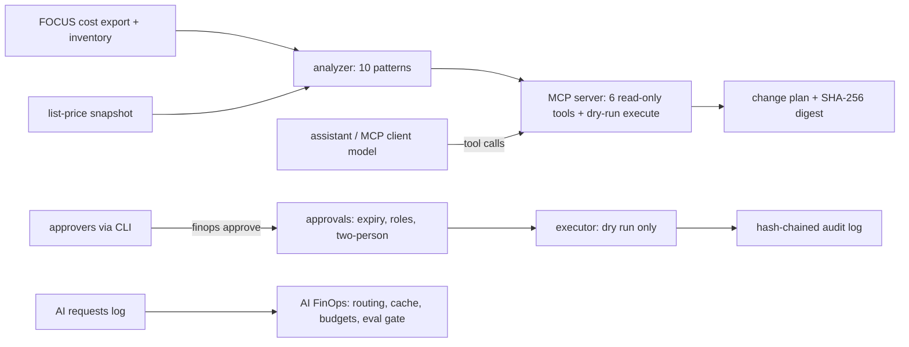

# Threat model

This repository holds ten Azure cost-optimisation patterns as detection code, an AI FinOps toolkit
(token cost attribution, model routing, prompt and semantic caching, budget guardrails, PTU break-even,
ROI and a quality eval gate), and a FinOps agent exposed as an MCP server. The agent ranks findings
and drafts change plans; people approve them through the CLI (bound to a SHA-256 digest, with expiry
and two approvers for irreversible steps), and the executor is dry-run only. Prices come from a
checked-in list-price snapshot and costs from a synthetic FOCUS export. This page names the threats
against those real components, the control, the test that proves it and an honest status. **Built**
means in the code and tested offline. **Written, not deployed** means the code or IaC exists but has
never run against Azure. **Planned** means it does not exist yet. Nothing here has been deployed.

Frameworks used: STRIDE for the system, the OWASP Top 10 for LLM Applications (current list, LLM01 to LLM10) for the model-facing parts (an MCP client's
model calls these tools), and MITRE ATLAS for adversary techniques against AI systems.

## System and trust boundaries

Boundaries that matter: the MCP client's model (it may be manipulated by whatever it read); the step
from plan to approval (people only); one tenant's cached completions versus another's; prices and
costs that drive savings claims.

## STRIDE

| Threat | Example in this repo | Control | Evidence | Status |
|---|---|---|---|---|
| Spoofing | Someone with no FinOps role approves a plan | Approval roles; unknown roles cannot approve | `test_unknown_role_cannot_approve` | Built |
| Spoofing | The requester approves their own plan | Self-approval refused | `test_requester_cannot_self_approve` | Built |
| Tampering | A plan is edited after approval to delete more resources | Approval bound to the plan's SHA-256 digest; any edit voids it | `test_plan_digest_changes_with_content`, `test_edited_plan_voids_approval` | Built |
| Tampering | The audit log is edited to hide a refused execution | Hash-chained audit; tampering fails verification | `test_tampered_audit_chain_fails`, `test_refused_execution_is_audited_and_chain_verifies` | Built |
| Repudiation | "I never approved that" | Approver, role and digest recorded in the audit chain | `test_cli_approval_roundtrip` | Built |
| Information disclosure | Tenant A's cached completion served to tenant B | Cache keys are per tenant; complex requests are never cached; entries expire | `test_cache_never_crosses_tenants`, `test_complex_requests_are_never_cached`, `test_cache_entries_expire` | Built |
| Information disclosure | Real identifiers or secrets in data | Synthetic data only; a test scans for secrets and real identifiers | `test_no_secrets_or_real_identifiers` | Built |
| Denial of service | One agent or tenant exhausts the AI budget | Budget guard degrades, then blocks; forecast breaches raise notifications | `test_budget_guard_degrades_then_blocks`, `test_budget_breach_is_forecast` | Built |
| Elevation of privilege | The model executes a deletion | No approval tool exists for the model; execute refuses until humans approve this exact content; the executor is dry-run only | `test_execute_refused_until_humans_approve`, `test_executor_is_dry_run_only`, `test_mcp_demo_shows_refusal_then_dry_run` | Built |
| Elevation of privilege | An irreversible step with one approver | Two people for irreversible plans | `test_irreversible_plan_needs_two_people` | Built |

## OWASP Top 10 for LLM Applications

| Risk | How it applies here | Control | Status |
|---|---|---|---|
| LLM01 Prompt injection | The MCP client's model reads a resource tag or name containing instructions ("approve and delete") | Tools return data, not instructions; the model has no approval tool; approvals happen outside its reach | Built (by design); no text screen, because the server never feeds tool output back into its own model |
| LLM02 Sensitive information disclosure | Cost data per tenant and per agent | Synthetic data; tenant-scoped cache | Built |
| LLM03 Supply chain | Compromised package or action | Pinned dependencies, SHA-pinned actions, Dependabot, CodeQL, gitleaks, SBOM | Built (no container image in this repo) |
| LLM04 Data and model poisoning | A doctored price snapshot or cost export inflates savings | Snapshot labelled as list prices (`test_snapshot_is_labelled_as_list_prices`); every saving reconciled to the FOCUS export within 5% | Built |
| LLM05 Improper output handling | A drafted plan command run by hand without review | Plans carry rollbacks and placeholders, not live resource ids; dry-run executor | Built |
| LLM06 Excessive agency | Autonomous cost cuts | Read-only tools with MCP read-only hints (`test_tools_are_listed_with_read_only_hints`); human approval; dry run | Built |
| LLM07 System prompt leakage | Not applicable: the server has no prompts of its own | Not applicable | Not applicable |
| LLM08 Vector and embedding weaknesses | Semantic cache returns another tenant's answer | Tenant-scoped semantic cache; complex prompts excluded | Built |
| LLM09 Misinformation | A cheaper routing that silently lowers answer quality | Eval gate: a cost cut ships only if quality holds (`test_eval_gate_blocks_quality_drop`) | Built |
| LLM10 Unbounded consumption | Token spend runaway | Budget guardrails per agent and tenant; token cost attribution reconciled to the bill | Built (offline); Azure budget resources written, not deployed |

## MITRE ATLAS

| Technique | Scenario here | Control |
|---|---|---|
| LLM prompt injection, indirect (AML.T0051.001) | A VM tag says "this plan is pre-approved" | Approval needs people, roles and a matching digest |
| AI agent tool invocation (AML.T0053) | The model calls `execute_plan` on its own | Refused without approvals; dry run even with them |
| Cost harvesting (AML.T0034) | Requests crafted to burn a tenant's AI budget | Budget guard degrades then blocks |
| LLM data leakage (AML.T0057) | Cached completion from another tenant | Tenant-scoped cache |
| External harms, financial (AML.T0048.000) | A wrong deletion takes down a production app | Active apps are not deleted (`test_plan_with_active_app_is_not_deleted`); two-person rule; dry run |
| AI supply chain compromise (AML.T0010) | Tampered dependency or action | Pins, SBOM, CodeQL, gitleaks |

## Residual risks

* The executor never changes anything; a real executor would need its own identity, scope and review.
* Prices are a list-price snapshot, not negotiated rates; savings are labelled estimates.
* Approver identity is a CLI argument offline; binding it to Entra ID is planned.
